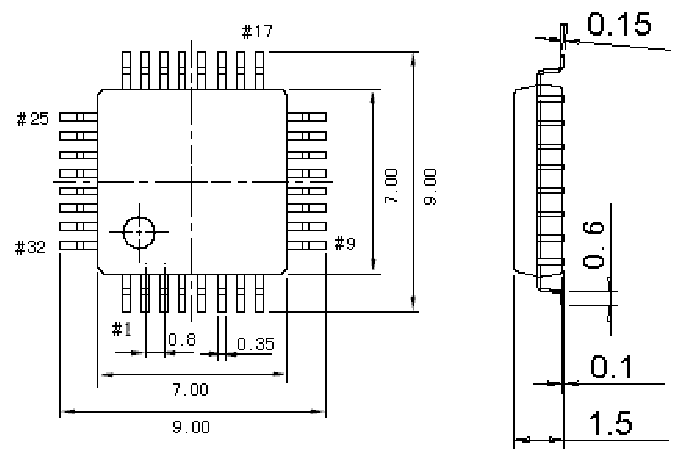

<!-- source-page: 42 -->

[← p.41](0041.md) · [index](../README.md) · [PDF p.42](https://ch32-riscv-ug.github.io/WCH-common/datasheet_zh/PACKAGE.PDF#page=42) · [p.43 →](0043.md)

<!-- header: 常用封装尺寸 ４２ https://wch.cn -->
. LQFP32（LQFP32-7*7）  

 <!-- p42-draw-image-00001 rendered from the PDF -->
