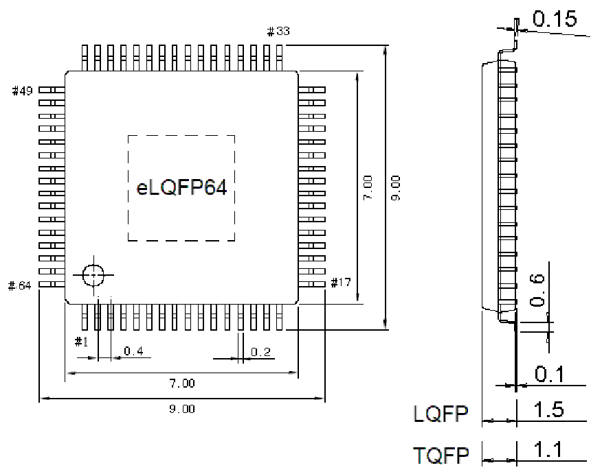

<!-- source-page: 45 -->

[← p.44](0044.md) · [index](../README.md) · [PDF p.45](https://ch32-riscv-ug.github.io/WCH-common/datasheet_zh/PACKAGE.PDF#page=45) · [p.46 →](0046.md)

<!-- header: 常用封装尺寸 ４５ https://wch.cn -->
. LQFP64（LQFP64-7*7）、TQFP64、eLQFP64  
eLQFP64 Exposed Pad：3.2*3.2  

 <!-- p45-draw-image-00001 rendered from the PDF -->
