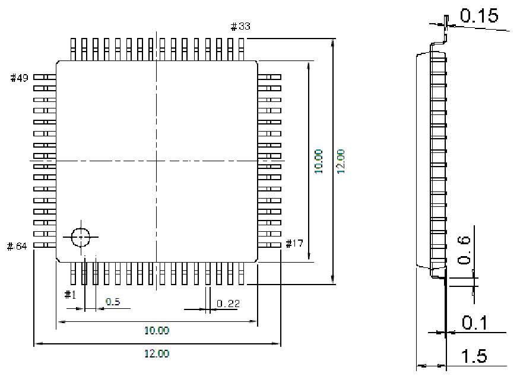

<!-- source-page: 46 -->

[← p.45](0045.md) · [index](../README.md) · [PDF p.46](https://ch32-riscv-ug.github.io/WCH-common/datasheet_zh/PACKAGE.PDF#page=46) · [p.47 →](0047.md)

<!-- header: 常用封装尺寸 ４６ https://wch.cn -->
. LQFP64M（LQFP64-10*10）  

 <!-- p46-draw-image-00001 rendered from the PDF -->
