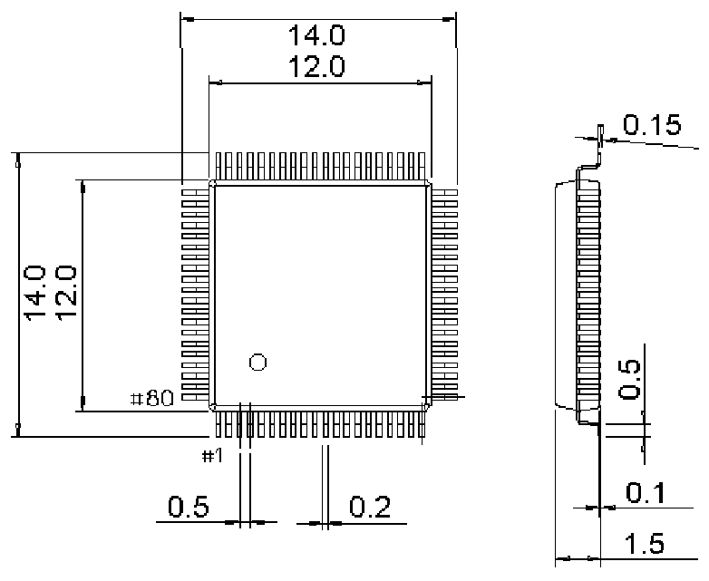

<!-- source-page: 47 -->

[← p.46](0046.md) · [index](../README.md) · [PDF p.47](https://ch32-riscv-ug.github.io/WCH-common/datasheet_zh/PACKAGE.PDF#page=47) · [p.48 →](0048.md)

<!-- header: 常用封装尺寸 ４７ https://wch.cn -->
. LQFP80（LQFP80-12*12）  

 <!-- p47-draw-image-00001 rendered from the PDF -->
