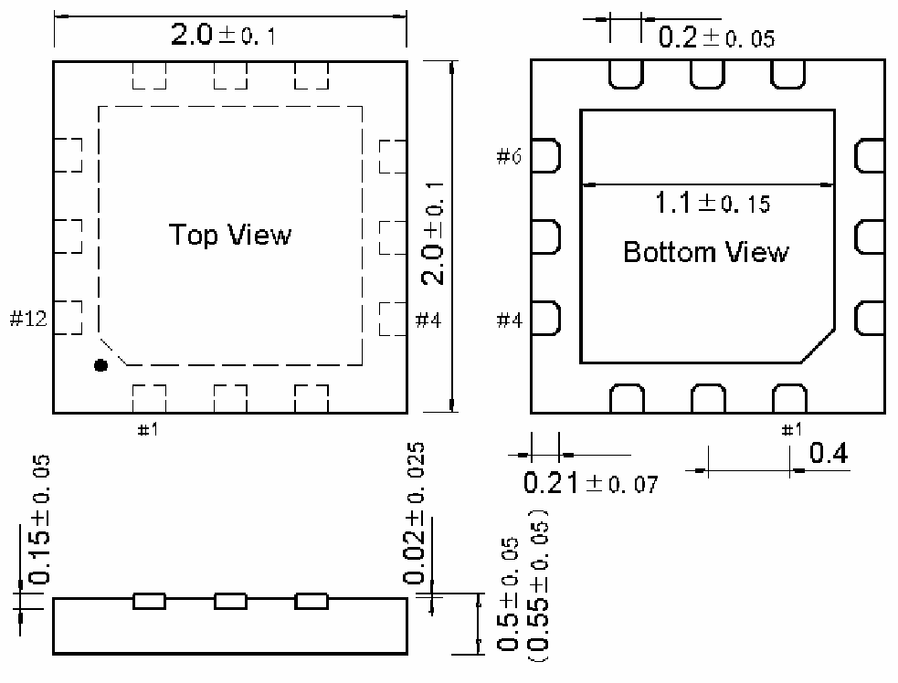

<!-- source-page: 54 -->

[← p.53](0053.md) · [index](../README.md) · [PDF p.54](https://ch32-riscv-ug.github.io/WCH-common/datasheet_zh/PACKAGE.PDF#page=54) · [p.55 →](0055.md)

<!-- header: 常用封装尺寸 ５４ https://wch.cn -->
. QFN12（QFN12-2*2*0.5-0.4）  

 <!-- p54-draw-image-00001 rendered from the PDF -->
