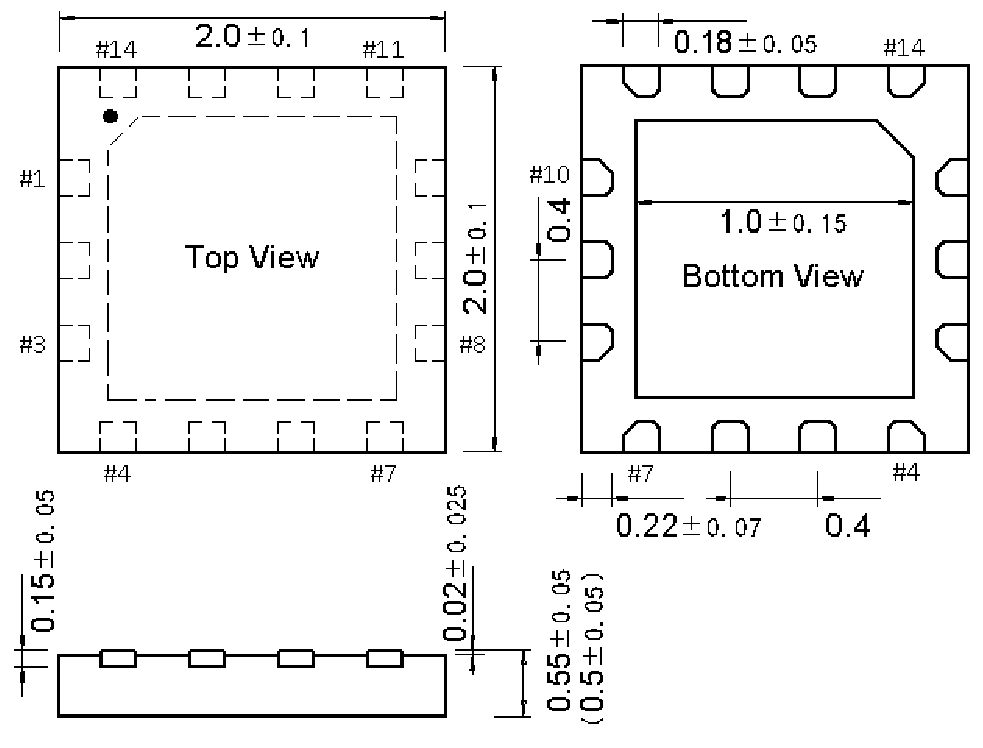

<!-- source-page: 55 -->

[← p.54](0054.md) · [index](../README.md) · [PDF p.55](https://ch32-riscv-ug.github.io/WCH-common/datasheet_zh/PACKAGE.PDF#page=55) · [p.56 →](0056.md)

<!-- header: 常用封装尺寸 ５５ https://wch.cn -->
. QFN14（QFN14-2*2*0.55-0.4）  

 <!-- p55-draw-image-00001 rendered from the PDF -->
