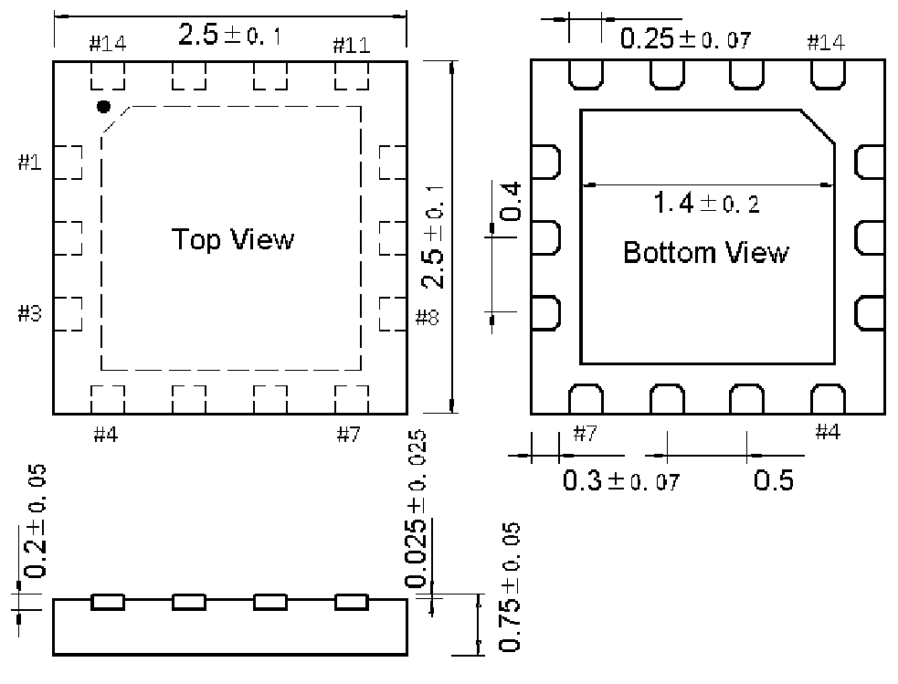

<!-- source-page: 56 -->

[← p.55](0055.md) · [index](../README.md) · [PDF p.56](https://ch32-riscv-ug.github.io/WCH-common/datasheet_zh/PACKAGE.PDF#page=56) · [p.57 →](0057.md)

<!-- header: 常用封装尺寸 ５６ https://wch.cn -->
. QFN14X25（QFN14-2.5*2.5*0.75-0.5）  

 <!-- p56-draw-image-00001 rendered from the PDF -->
