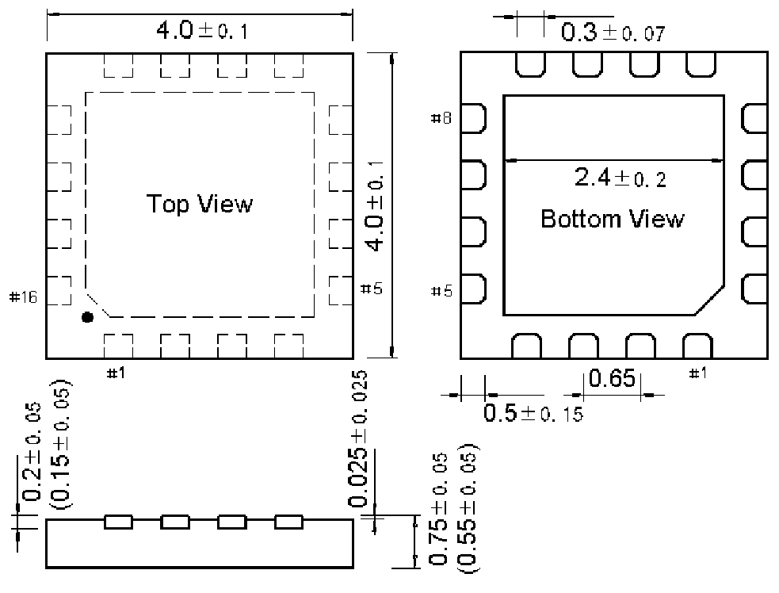

<!-- source-page: 61 -->

[← p.60](0060.md) · [index](../README.md) · [PDF p.61](https://ch32-riscv-ug.github.io/WCH-common/datasheet_zh/PACKAGE.PDF#page=61) · [p.62 →](0062.md)

<!-- header: 常用封装尺寸 ６１ https://wch.cn -->
. QFN16X4（QFN16-4*4-0.65）  

 <!-- p61-draw-image-00001 rendered from the PDF -->
