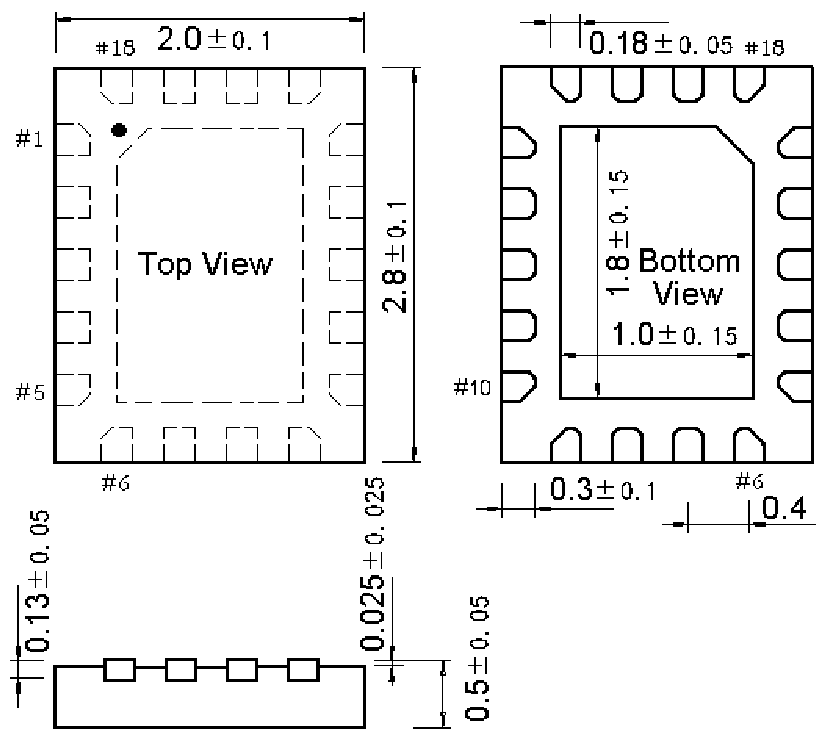

<!-- source-page: 62 -->

[← p.61](0061.md) · [index](../README.md) · [PDF p.62](https://ch32-riscv-ug.github.io/WCH-common/datasheet_zh/PACKAGE.PDF#page=62) · [p.63 →](0063.md)

<!-- header: 常用封装尺寸 ６２ https://wch.cn -->
. QFN18X2X28（QFN18-2*2.8*0.5-0.4）  

 <!-- p62-draw-image-00001 rendered from the PDF -->
