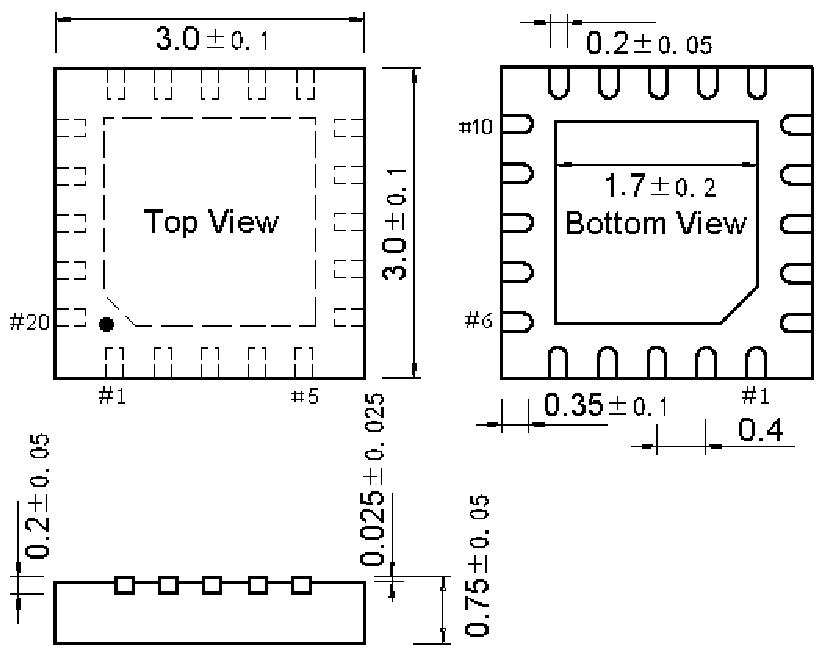

<!-- source-page: 64 -->

[← p.63](0063.md) · [index](../README.md) · [PDF p.64](https://ch32-riscv-ug.github.io/WCH-common/datasheet_zh/PACKAGE.PDF#page=64) · [p.65 →](0065.md)

<!-- header: 常用封装尺寸 ６４ https://wch.cn -->
. QFN20L（QFN20L-3*3-0.4）  

 <!-- p64-draw-image-00001 rendered from the PDF -->
