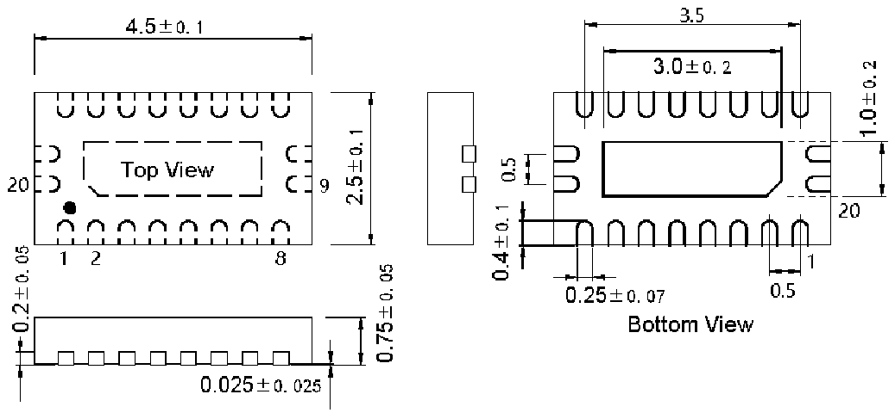

<!-- source-page: 67 -->

[← p.66](0066.md) · [index](../README.md) · [PDF p.67](https://ch32-riscv-ug.github.io/WCH-common/datasheet_zh/PACKAGE.PDF#page=67) · [p.68 →](0068.md)

<!-- header: 常用封装尺寸 ６７ https://wch.cn -->
. QFN20X25X45（QFN20-2.5*4.5*0.75-0.5）  

 <!-- p67-draw-image-00001 rendered from the PDF -->
