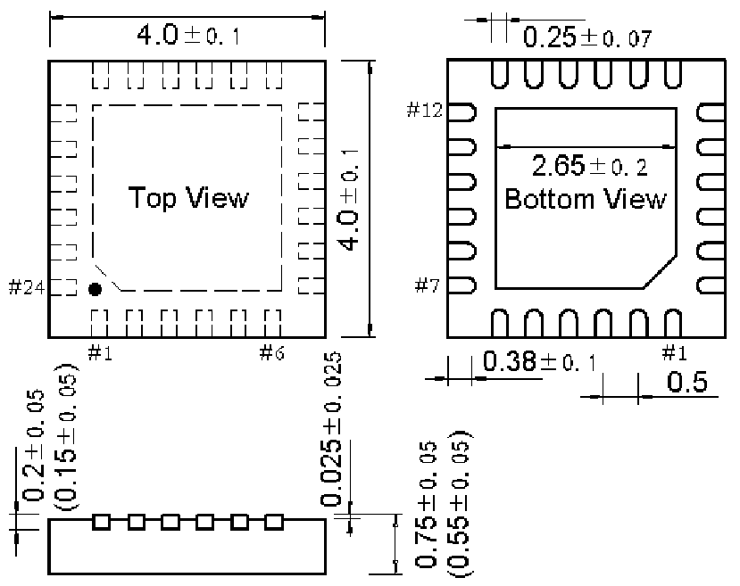

<!-- source-page: 69 -->

[← p.68](0068.md) · [index](../README.md) · [PDF p.69](https://ch32-riscv-ug.github.io/WCH-common/datasheet_zh/PACKAGE.PDF#page=69) · [p.70 →](0070.md)

<!-- header: 常用封装尺寸 ６９ https://wch.cn -->
. QFN24（QFN24-4*4-0.5）  

 <!-- p69-draw-image-00001 rendered from the PDF -->
