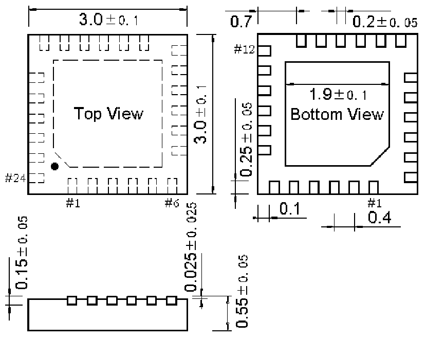

<!-- source-page: 70 -->

[← p.69](0069.md) · [index](../README.md) · [PDF p.70](https://ch32-riscv-ug.github.io/WCH-common/datasheet_zh/PACKAGE.PDF#page=70) · [p.71 →](0071.md)

<!-- header: 常用封装尺寸 ７０ https://wch.cn -->
. QFN24X3（QFN24-3*3*0.55-0.4）  

 <!-- p70-draw-image-00001 rendered from the PDF -->
