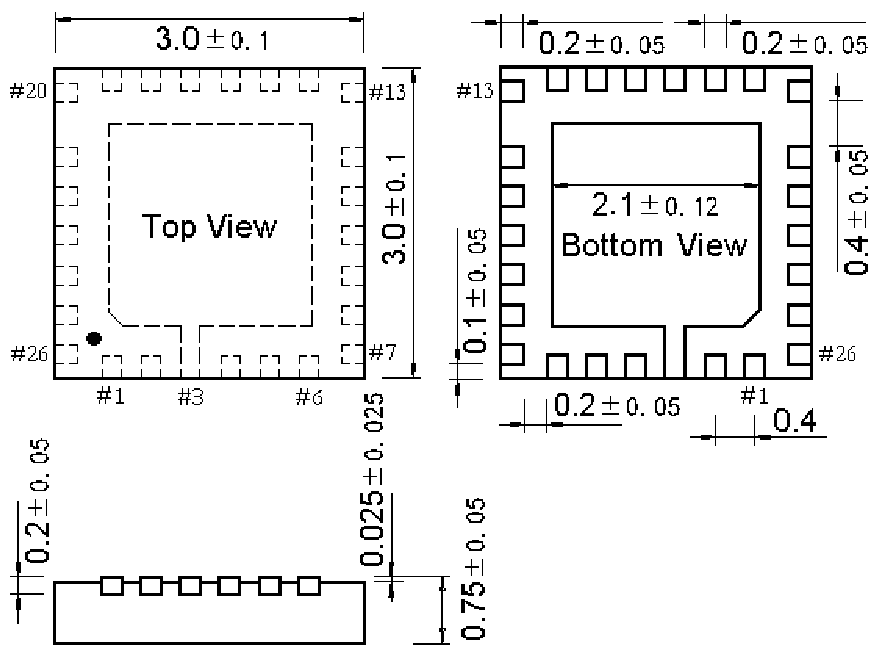

<!-- source-page: 72 -->

[← p.71](0071.md) · [index](../README.md) · [PDF p.72](https://ch32-riscv-ug.github.io/WCH-common/datasheet_zh/PACKAGE.PDF#page=72) · [p.73 →](0073.md)

<!-- header: 常用封装尺寸 ７２ https://wch.cn -->
. QFN26C3（QFN26C-3*3*0.75-0.4）  

 <!-- p72-draw-image-00001 rendered from the PDF -->
