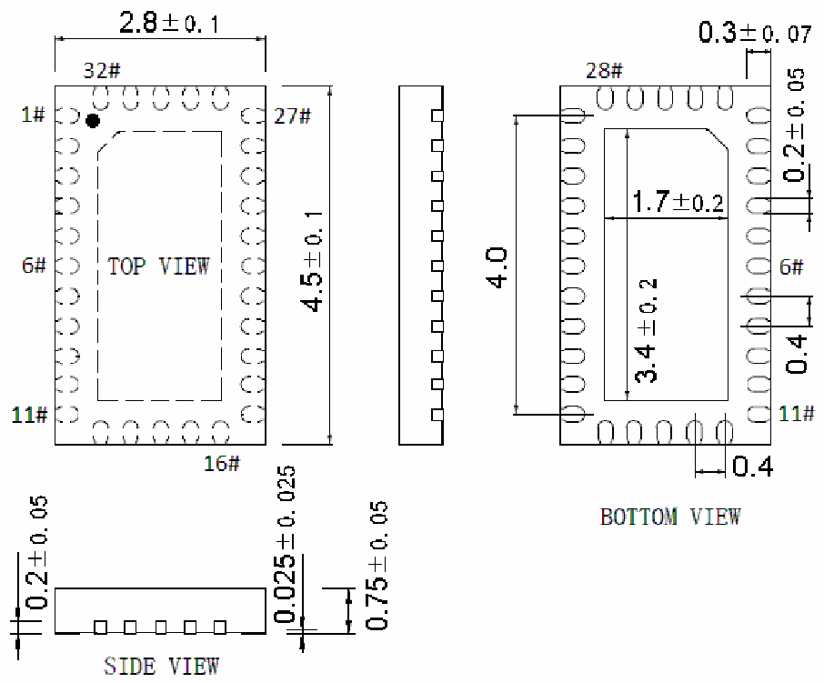

<!-- source-page: 78 -->

[← p.77](0077.md) · [index](../README.md) · [PDF p.78](https://ch32-riscv-ug.github.io/WCH-common/datasheet_zh/PACKAGE.PDF#page=78) · [p.79 →](0079.md)

<!-- header: 常用封装尺寸 ７８ https://wch.cn -->
. QFN32C28X45（QFN32C-2.8*4.5*0.75-0.4）  

 <!-- p78-draw-image-00001 rendered from the PDF -->
