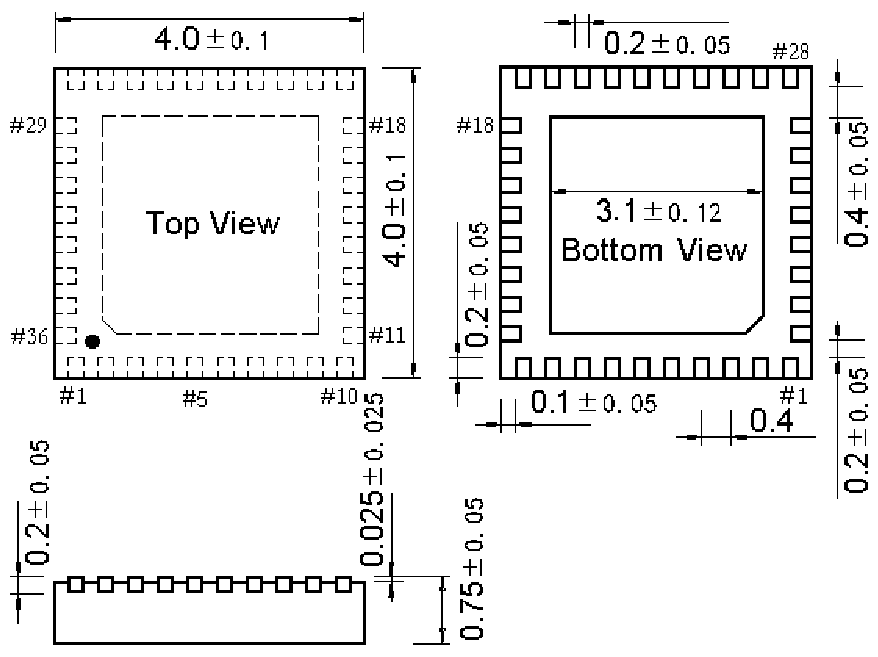

<!-- source-page: 79 -->

[← p.78](0078.md) · [index](../README.md) · [PDF p.79](https://ch32-riscv-ug.github.io/WCH-common/datasheet_zh/PACKAGE.PDF#page=79) · [p.80 →](0080.md)

<!-- header: 常用封装尺寸 ７９ https://wch.cn -->
. QFN36C4（QFN36C-4*4*0.75-0.4）  

 <!-- p79-draw-image-00001 rendered from the PDF -->
