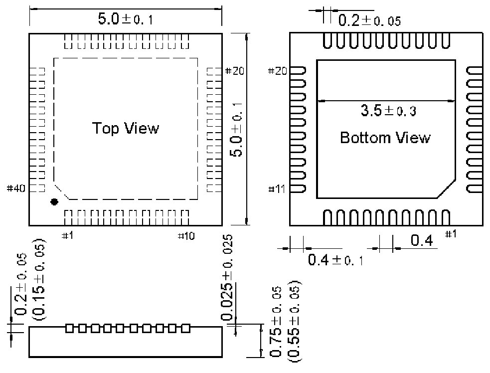

<!-- source-page: 82 -->

[← p.81](0081.md) · [index](../README.md) · [PDF p.82](https://ch32-riscv-ug.github.io/WCH-common/datasheet_zh/PACKAGE.PDF#page=82) · [p.83 →](0083.md)

<!-- header: 常用封装尺寸 ８２ https://wch.cn -->
. QFN40（QFN40-5*5-0.4）  

 <!-- p82-draw-image-00001 rendered from the PDF -->
