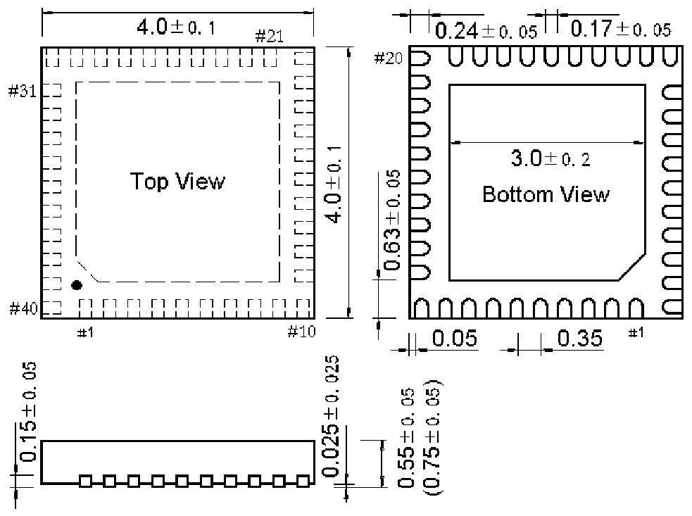

<!-- source-page: 83 -->

[← p.82](0082.md) · [index](../README.md) · [PDF p.83](https://ch32-riscv-ug.github.io/WCH-common/datasheet_zh/PACKAGE.PDF#page=83) · [p.84 →](0084.md)

<!-- header: 常用封装尺寸 ８３ https://wch.cn -->
. QFN40C4（QFN40C-4*4-0.35）  

 <!-- p83-draw-image-00001 rendered from the PDF -->
