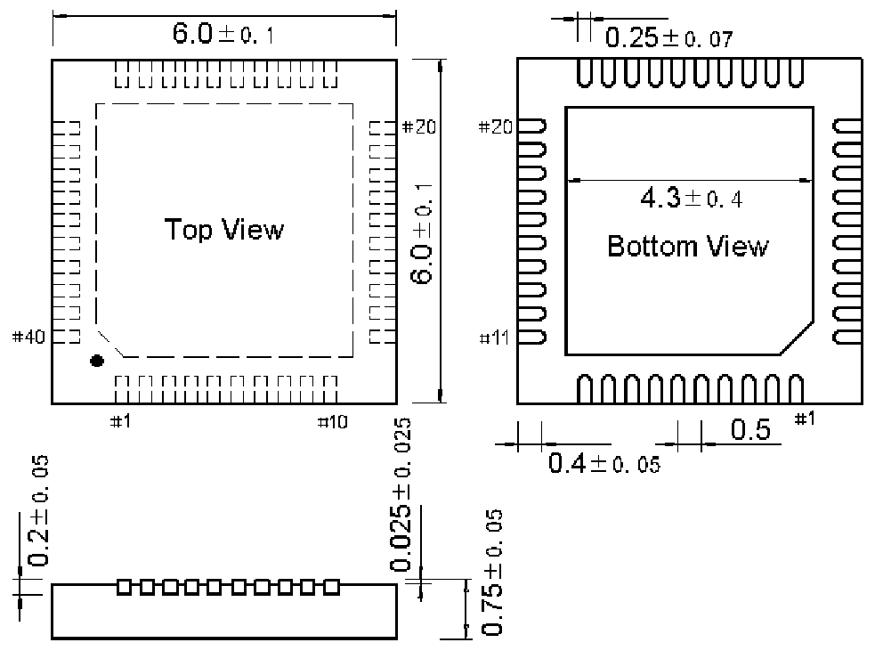

<!-- source-page: 84 -->

[← p.83](0083.md) · [index](../README.md) · [PDF p.84](https://ch32-riscv-ug.github.io/WCH-common/datasheet_zh/PACKAGE.PDF#page=84) · [p.85 →](0085.md)

<!-- header: 常用封装尺寸 ８４ https://wch.cn -->
. QFN40X6（QFN40-6*6-0.5）  

 <!-- p84-draw-image-00001 rendered from the PDF -->
