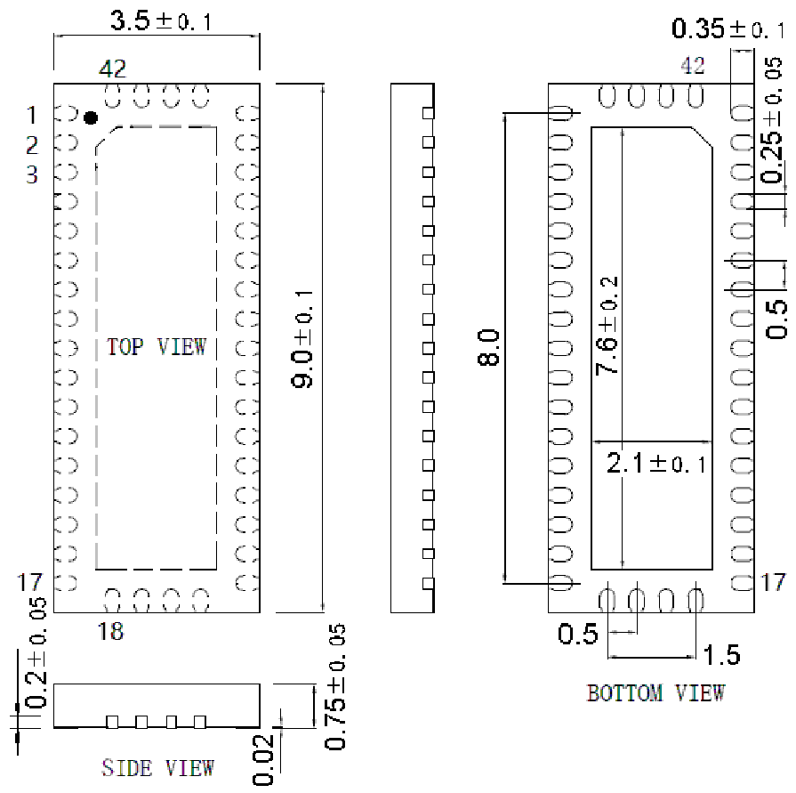

<!-- source-page: 85 -->

[← p.84](0084.md) · [index](../README.md) · [PDF p.85](https://ch32-riscv-ug.github.io/WCH-common/datasheet_zh/PACKAGE.PDF#page=85) · [p.86 →](0086.md)

<!-- header: 常用封装尺寸 ８５ https://wch.cn -->
. QFN42X35X9（QFN42-3.5*9*0.75-0.5）  

 <!-- p85-draw-image-00001 rendered from the PDF -->
