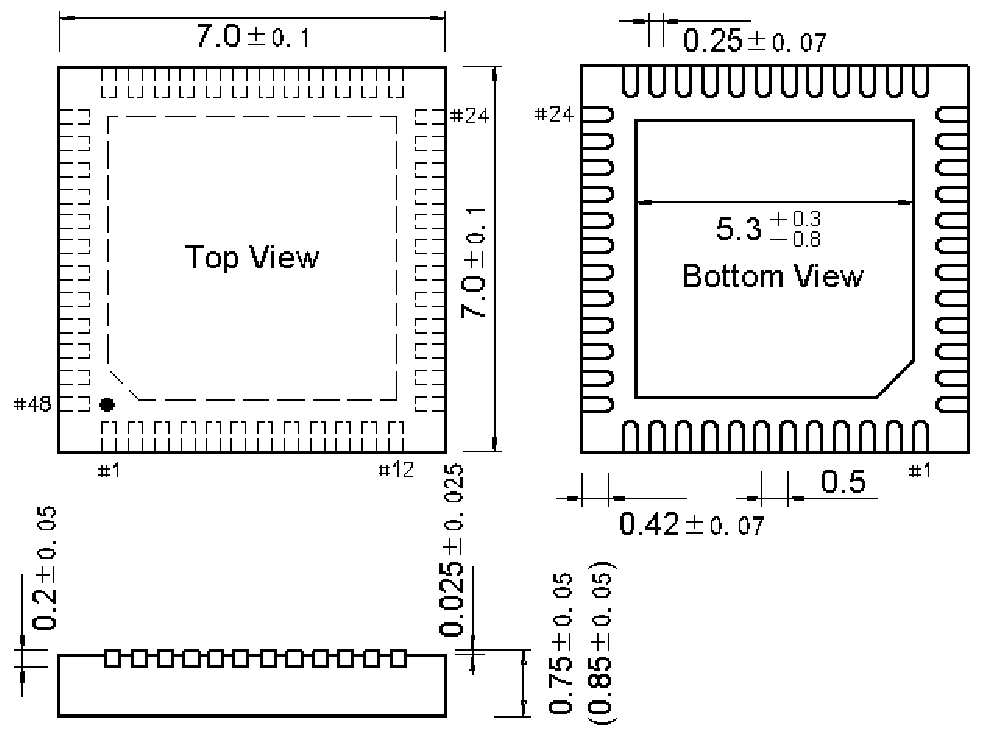

<!-- source-page: 91 -->

[← p.90](0090.md) · [index](../README.md) · [PDF p.91](https://ch32-riscv-ug.github.io/WCH-common/datasheet_zh/PACKAGE.PDF#page=91) · [p.92 →](0092.md)

<!-- header: 常用封装尺寸 ９１ https://wch.cn -->
. QFN48X7（QFN48-7*7-0.5）  

 <!-- p91-draw-image-00001 rendered from the PDF -->
