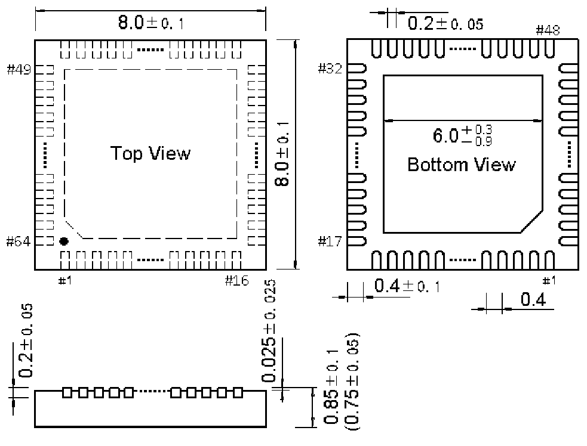

<!-- source-page: 97 -->

[← p.96](0096.md) · [index](../README.md) · [PDF p.97](https://ch32-riscv-ug.github.io/WCH-common/datasheet_zh/PACKAGE.PDF#page=97) · [p.98 →](0098.md)

<!-- header: 常用封装尺寸 ９７ https://wch.cn -->
. QFN64（QFN64-8*8-0.4）  

 <!-- p97-draw-image-00001 rendered from the PDF -->
