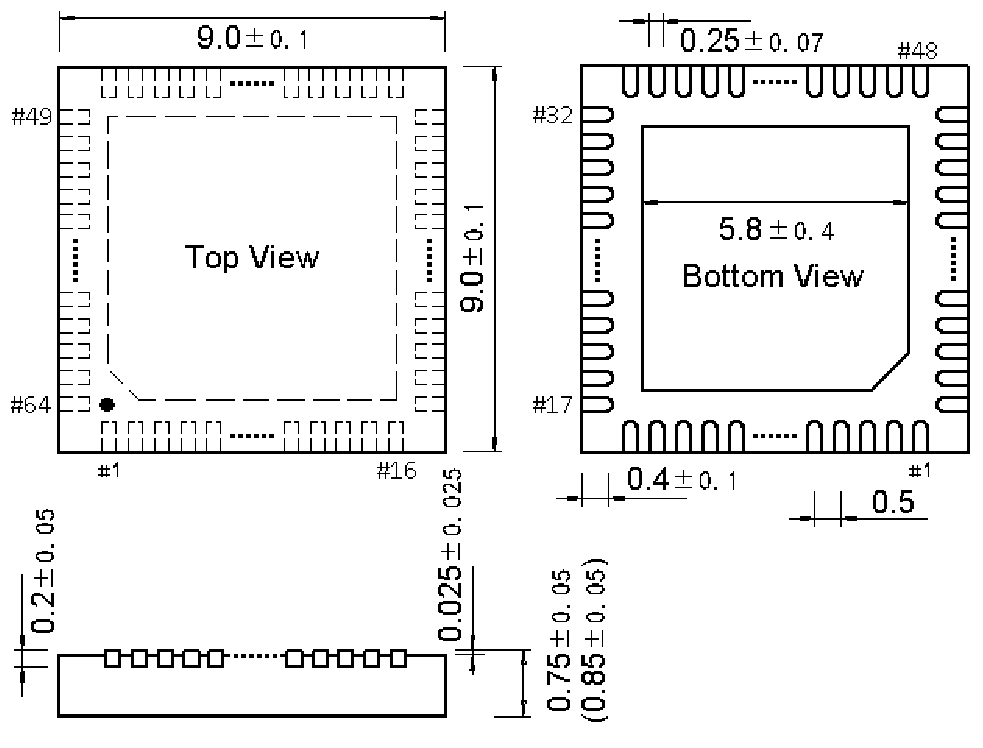

<!-- source-page: 98 -->

[← p.97](0097.md) · [index](../README.md) · [PDF p.98](https://ch32-riscv-ug.github.io/WCH-common/datasheet_zh/PACKAGE.PDF#page=98) · [p.99 →](0099.md)

<!-- header: 常用封装尺寸 ９８ https://wch.cn -->
. QFN64X9（QFN64-9*9-0.5）  

 <!-- p98-draw-image-00001 rendered from the PDF -->
