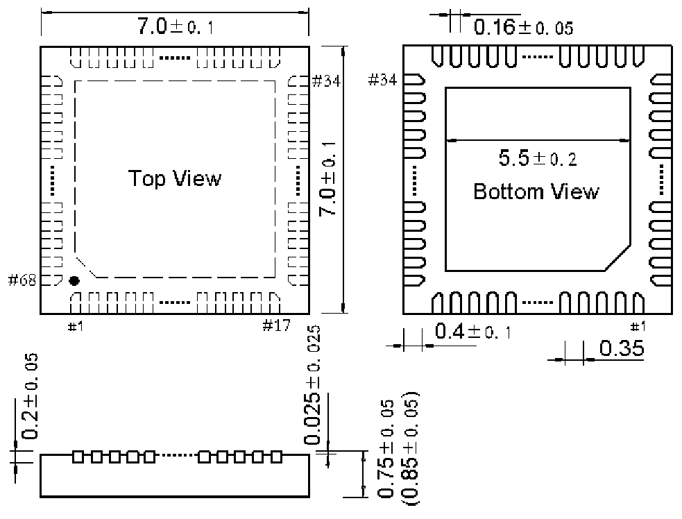

<!-- source-page: 100 -->

[← p.99](0099.md) · [index](../README.md) · [PDF p.100](https://ch32-riscv-ug.github.io/WCH-common/datasheet_zh/PACKAGE.PDF#page=100) · [p.101 →](0101.md)

<!-- header: 常用封装尺寸 １００ https://wch.cn -->
. QFN68X7（QFN68-7*7-0.35）  

 <!-- p100-draw-image-00001 rendered from the PDF -->
