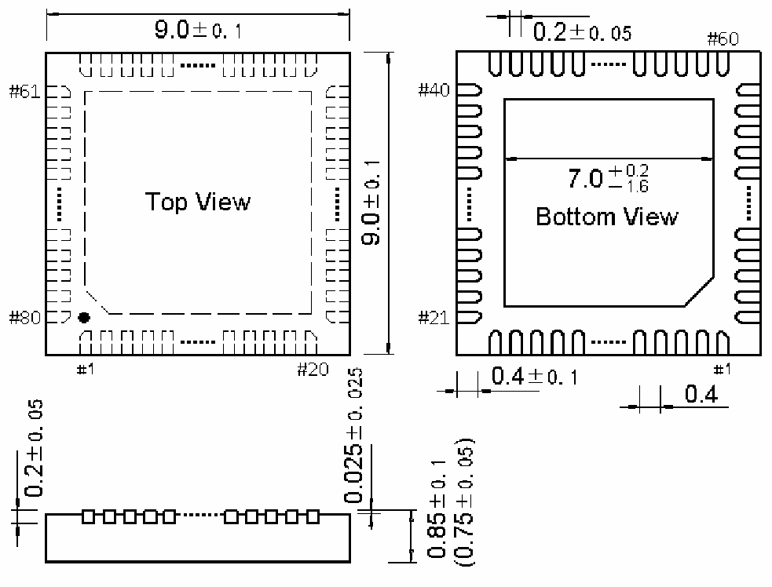

<!-- source-page: 102 -->

[← p.101](0101.md) · [index](../README.md) · [PDF p.102](https://ch32-riscv-ug.github.io/WCH-common/datasheet_zh/PACKAGE.PDF#page=102) · [p.103 →](0103.md)

<!-- header: 常用封装尺寸 １０２ https://wch.cn -->
. QFN80（QFN80-9*9-0.4）  

 <!-- p102-draw-image-00001 rendered from the PDF -->
