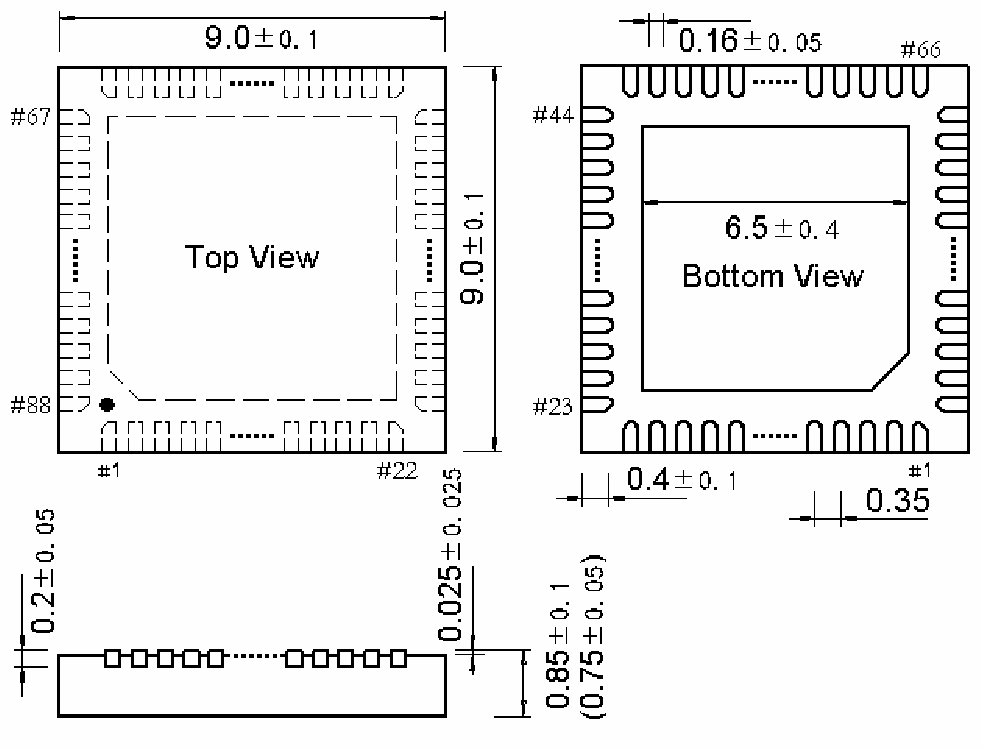

<!-- source-page: 104 -->

[← p.103](0103.md) · [index](../README.md) · [PDF p.104](https://ch32-riscv-ug.github.io/WCH-common/datasheet_zh/PACKAGE.PDF#page=104) · [p.105 →](0105.md)

<!-- header: 常用封装尺寸 １０４ https://wch.cn -->
. QFN88X9（QFN88-9*9-0.35）  

 <!-- p104-draw-image-00001 rendered from the PDF -->
