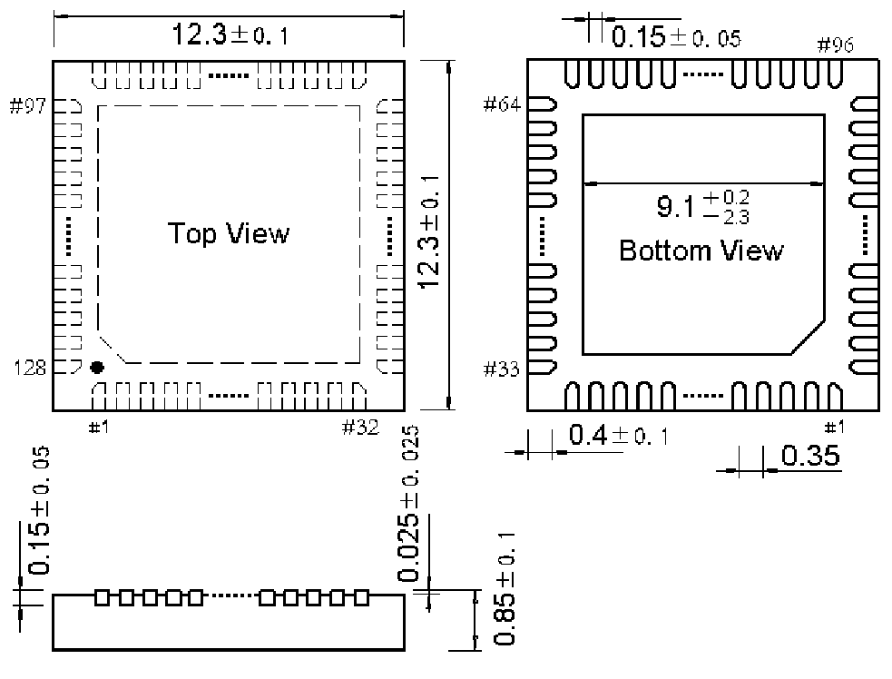

<!-- source-page: 106 -->

[← p.105](0105.md) · [index](../README.md) · [PDF p.106](https://ch32-riscv-ug.github.io/WCH-common/datasheet_zh/PACKAGE.PDF#page=106) · [p.107 →](0107.md)

<!-- header: 常用封装尺寸 １０６ https://wch.cn -->
. QFN128（QFN128-12.3*12.3-0.35）  

 <!-- p106-draw-image-00001 rendered from the PDF -->
