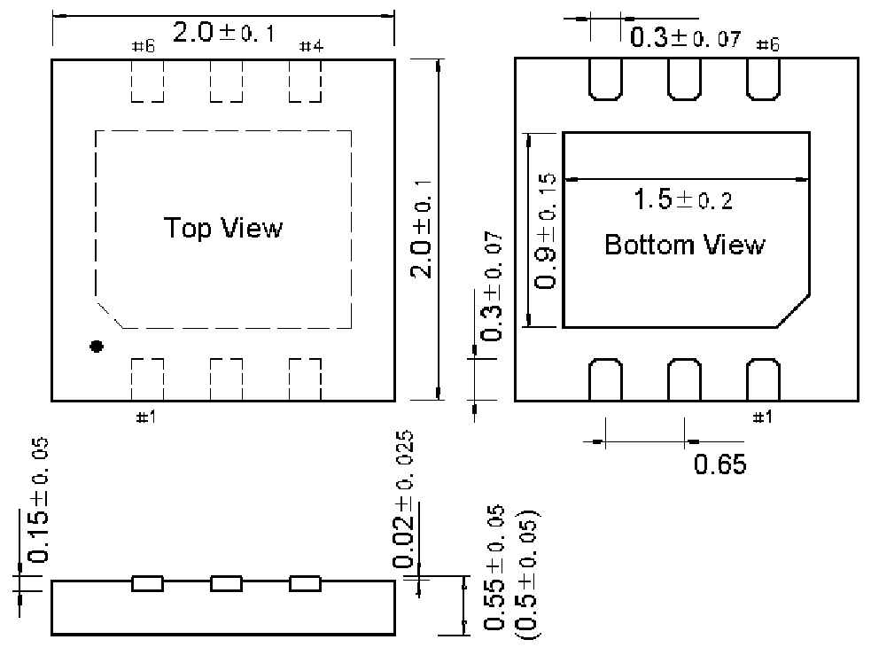

<!-- source-page: 108 -->

[← p.107](0107.md) · [index](../README.md) · [PDF p.108](https://ch32-riscv-ug.github.io/WCH-common/datasheet_zh/PACKAGE.PDF#page=108) · [p.109 →](0109.md)

<!-- header: 常用封装尺寸 １０８ https://wch.cn -->
. DFN6（DFN6-2*2-0.65）  

 <!-- p108-draw-image-00001 rendered from the PDF -->
