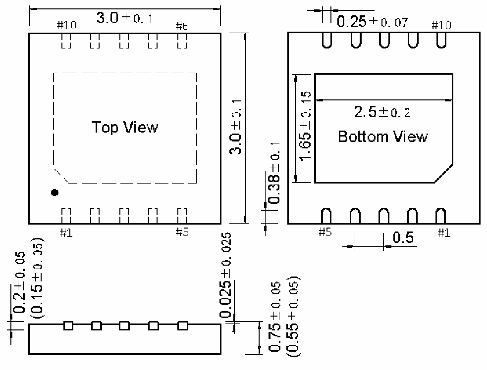

<!-- source-page: 111 -->

[← p.110](0110.md) · [index](../README.md) · [PDF p.111](https://ch32-riscv-ug.github.io/WCH-common/datasheet_zh/PACKAGE.PDF#page=111) · [p.112 →](0112.md)

<!-- header: 常用封装尺寸 １１１ https://wch.cn -->
. DFN10X3（DFN10-3*3-0.5）  

 <!-- p111-draw-image-00001 rendered from the PDF -->
