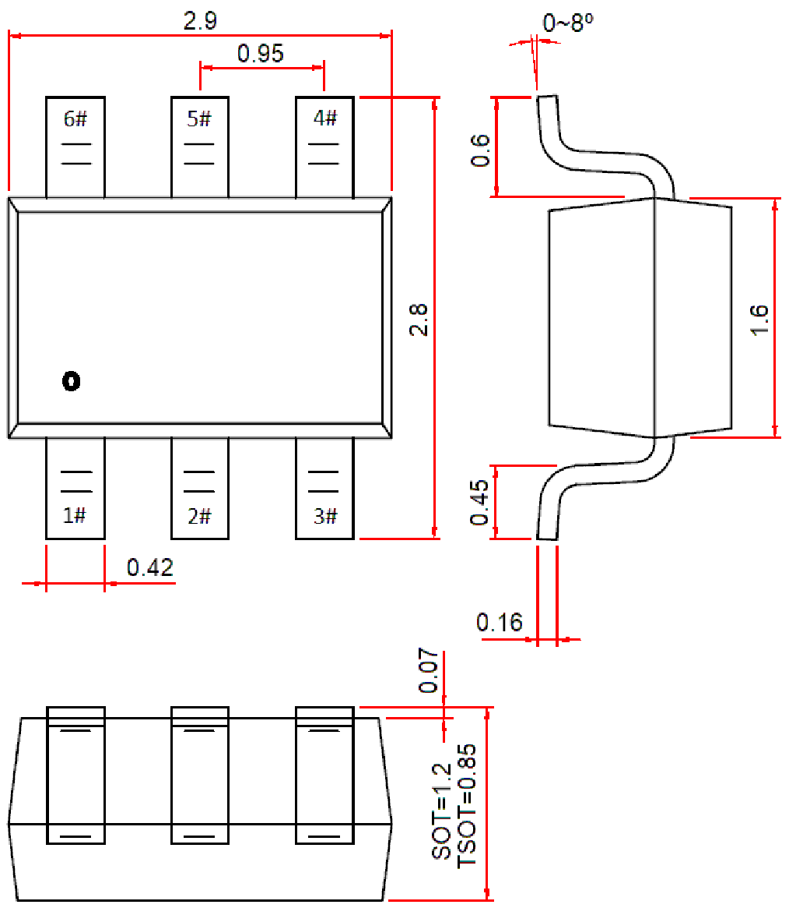

<!-- source-page: 114 -->

[← p.113](0113.md) · [index](../README.md) · [PDF p.114](https://ch32-riscv-ug.github.io/WCH-common/datasheet_zh/PACKAGE.PDF#page=114) · [p.115 →](0115.md)

<!-- header: 常用封装尺寸 １１４ https://wch.cn -->
. SOT23-6、TSOT23-6L、SOT26  

 <!-- p114-draw-image-00001 rendered from the PDF -->
