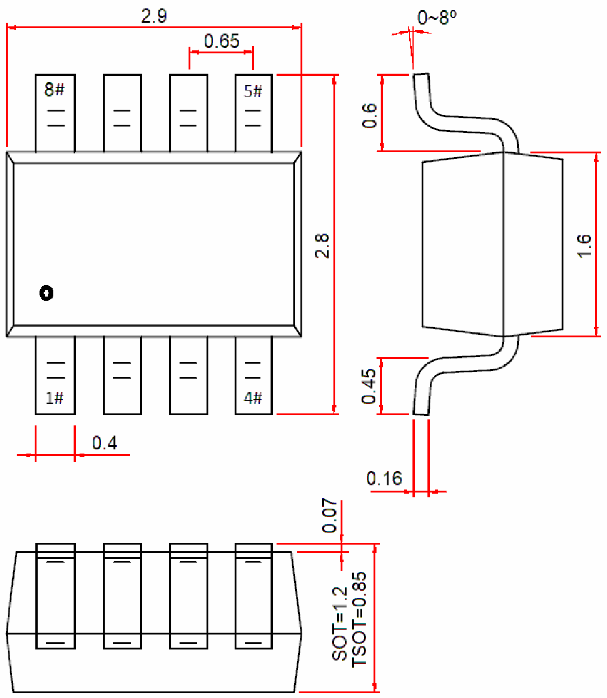

<!-- source-page: 115 -->

[← p.114](0114.md) · [index](../README.md) · [PDF p.115](https://ch32-riscv-ug.github.io/WCH-common/datasheet_zh/PACKAGE.PDF#page=115) · [p.116 →](0116.md)

<!-- header: 常用封装尺寸 １１５ https://wch.cn -->
. SOT23-8、TSOT23-8L、SOT28  

 <!-- p115-draw-image-00001 rendered from the PDF -->
