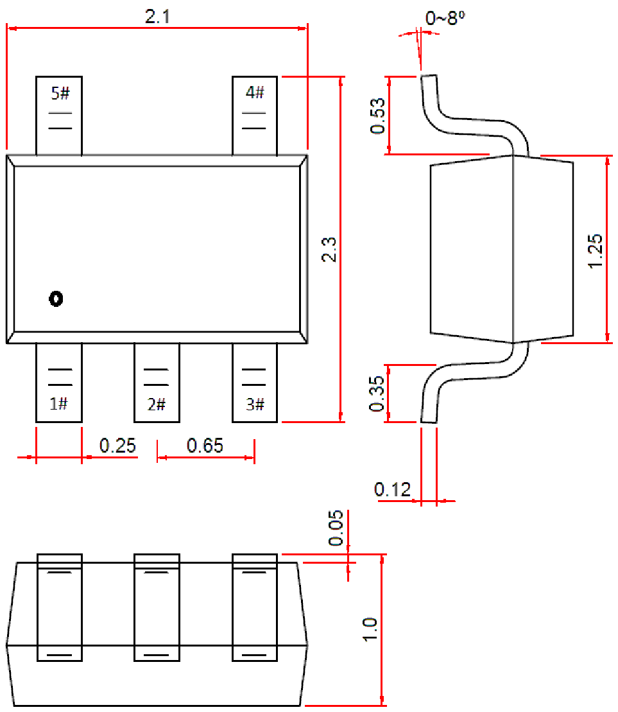

<!-- source-page: 117 -->

[← p.116](0116.md) · [index](../README.md) · [PDF p.117](https://ch32-riscv-ug.github.io/WCH-common/datasheet_zh/PACKAGE.PDF#page=117)

<!-- header: 常用封装尺寸 １１７ https://wch.cn -->
. SOT353（SC70-5L）  

 <!-- p117-draw-image-00001 rendered from the PDF -->
