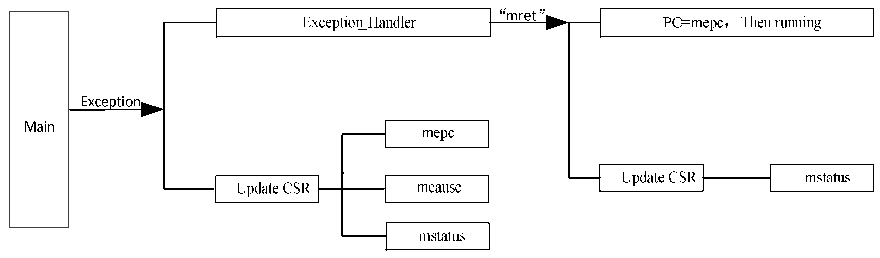

<!-- source-page: 7 -->

[← p.6](0006.md) · [index](../README.md) · [PDF p.7](https://ch32-riscv-ug.github.io/WCH-common/datasheet_en/QingKeV2_Processor_Manual.PDF#page=7) · [p.8 →](0008.md)

<!-- header: QingKeV2 Microprocessor Manual https://wch-ic.com -->
The entire exception response process can be described by the following Figure 2-1.  

Figure 2-1 Exception response process diagram  
 <!-- rendered from the PDF; verify at https://ch32-riscv-ug.github.io/WCH-common/datasheet_en/QingKeV2_Processor_Manual.PDF#page=7 -->

🖼 Text parsed from the figure above

<!-- image: p7-draw-image-00011 inside the figure -->
<!-- image: p7-draw-image-00013 inside the figure -->
<!-- image: p7-draw-image-00012 inside the figure -->
<!-- image: p7-draw-image-00003 inside the figure -->
<!-- image: p7-draw-image-00005 inside the figure -->
<!-- image: p7-draw-image-00018 inside the figure -->
<!-- image: p7-draw-image-00014 inside the figure -->
<!-- image: p7-draw-image-00016 inside the figure -->
<!-- image: p7-draw-image-00015 inside the figure -->
<!-- image: p7-draw-image-00017 inside the figure -->
<!-- image: p7-draw-image-00004 inside the figure -->
<!-- image: p7-draw-image-00020 inside the figure -->
<!-- image: p7-draw-image-00002 inside the figure -->
<!-- image: p7-draw-image-00007 inside the figure -->
<!-- image: p7-draw-image-00019 inside the figure -->
<!-- image: p7-draw-image-00010 inside the figure -->
<!-- image: p7-draw-image-00006 inside the figure -->
<!-- image: p7-draw-image-00008 inside the figure -->
<!-- image: p7-draw-image-00009 inside the figure -->

<!-- image: p7-draw-image-00001 bbox=[507.84, 791.76, 527.28, 802.32] -->
<!-- footer: V1.3 6 -->
