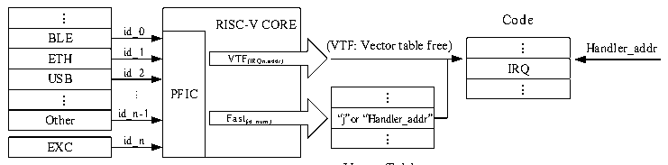

<!-- source-page: 16 -->

[← p.15](0015.md) · [index](../README.md) · [PDF p.16](https://ch32-riscv-ug.github.io/WCH-common/datasheet_en/QingKeV2_Processor_Manual.PDF#page=16) · [p.17 →](0017.md)

<!-- header: QingKeV2 Microprocessor Manual https://wch-ic.com -->

> ⬆ **Table continued** — rendered in full at [page 15](0015.md). <!-- p16-table-001 -->

<em>Note: 1. Interrupt functions using the HPE need to be compiled using MRS or its provided toolchain and the</em>  
<em>interrupt function needs to be declared with __attribute__((interrupt(&quot;WCH-Interrupt-fast&quot;))).</em>  
<em>2. The interrupt function using stack push is declared by __attribute__((interrupt())).</em>  

## 3.5 Vector Table Free (VTF)

The Programmable Fast Interrupt Controller (PFIC) provides two VTF channels, i.e., direct access to the  
interrupt function entry without going through the interrupt vector table lookup process.  
While configuring an interrupt function normally, write its interrupt number to one of the channels x of the  
VTF ID register PFIC_VTFIDR, and write its entry address to the corresponding VTF address register  
VTFADDRRx, and enable the VTF for that channel.  
The PFIC responds to fast interrupts and VTF as shown in Figure 3-2 below.  

Figure 3-2 Schematic diagram of programmable fast interrupt controller  
 <!-- rendered from the PDF; verify at https://ch32-riscv-ug.github.io/WCH-common/datasheet_en/QingKeV2_Processor_Manual.PDF#page=16 -->

Peripherals  

🖼 Text parsed from the figure above

...  BLE  ETH  ETHUSB  ...  Other  
RISC-V COREVTF(IRQn,addr) PFICFast(id_num)  VTF(IRQn,addr)  VTF(IRQn,addr)  Fast(id_num)  
Code  
id_0  
...  IRQ  ...  
id_1  
id_2  
...  “j”o r“Handler_addr”  ...  
...  
id_n-1  
id_n  
EXC  

Vector Table  

## 3.6 Tail-chaining and Late Arrivals

QingKe V2 series HPE saves registers to the user stack area and supports priority configuration and interrupt  
nesting. When the tail-chaining phenomenon occurs, i.e., when responding to a high-priority interrupt, there  
is a low-priority interrupt hanging at the same time. When the high-priority interrupt is executed, the stack  
out of the high-priority middle end is omitted and the stack in operation before executing the pending  
interrupt is performed to reduce the interrupt latency.  
Similarly, when the processor is processing the stacking operation of a low-priority interrupt and receives a  
late request for a high-priority interrupt, the high-priority interrupt does not repeat the stacking operation and  
directly follows the previous operation.  
<!-- image: p16-draw-image-00001 bbox=[507.84, 791.76, 527.28, 802.32] -->
<!-- footer: V1.3 15 -->
