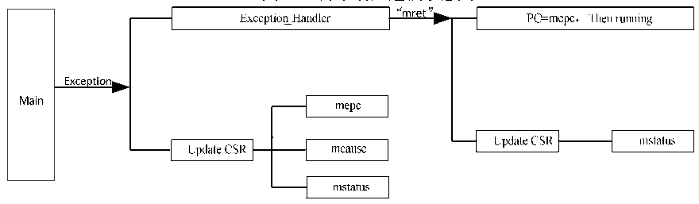

<!-- source-page: 6 -->

[← p.5](0005.md) · [index](../README.md) · [PDF p.6](https://ch32-riscv-ug.github.io/WCH-common/datasheet_zh/QingKeV2_Processor_Manual.PDF#page=6) · [p.7 →](0007.md)

<!-- header: QingKeV2微处理器手册 http://wch.cn -->

图2-1 异常响应过程示意图  
 <!-- rendered from the PDF; verify at https://ch32-riscv-ug.github.io/WCH-common/datasheet_zh/QingKeV2_Processor_Manual.PDF#page=6 -->

🖼 Text parsed from the figure above

<!-- image: p6-draw-image-00011 inside the figure -->
<!-- image: p6-draw-image-00013 inside the figure -->
<!-- image: p6-draw-image-00012 inside the figure -->
<!-- image: p6-draw-image-00003 inside the figure -->
<!-- image: p6-draw-image-00005 inside the figure -->
<!-- image: p6-draw-image-00018 inside the figure -->
<!-- image: p6-draw-image-00014 inside the figure -->
<!-- image: p6-draw-image-00016 inside the figure -->
<!-- image: p6-draw-image-00015 inside the figure -->
<!-- image: p6-draw-image-00017 inside the figure -->
<!-- image: p6-draw-image-00004 inside the figure -->
<!-- image: p6-draw-image-00020 inside the figure -->
<!-- image: p6-draw-image-00002 inside the figure -->
<!-- image: p6-draw-image-00007 inside the figure -->
<!-- image: p6-draw-image-00019 inside the figure -->
<!-- image: p6-draw-image-00010 inside the figure -->
<!-- image: p6-draw-image-00006 inside the figure -->
<!-- image: p6-draw-image-00008 inside the figure -->
<!-- image: p6-draw-image-00009 inside the figure -->

<!-- image: p6-draw-image-00001 bbox=[507.84, 786.36, 527.28, 796.68] -->
<!-- footer: V1.3 5 -->
