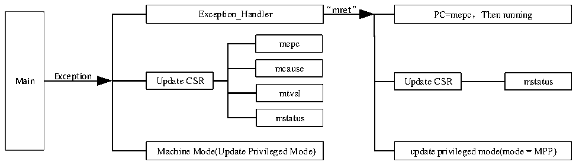

<!-- source-page: 8 -->

[← p.7](0007.md) · [index](../README.md) · [PDF p.8](https://ch32-riscv-ug.github.io/WCH-common/datasheet_en/QingKeV3_Processor_Manual.PDF#page=8) · [p.9 →](0009.md)

<!-- header: QingKeV3 Microprocessor Manual https://wch-ic.com -->

## 2.4 Exception Exit

After the exception or interrupt handler is completed, it is necessary to exit from the service program. After  
entering exceptions and interrupts, the microprocessor enters Machine mode from User mode, and the  
processing of exceptions and interrupts is also completed in Machine mode. When it is necessary to exit  
exceptions and interrupts, it is necessary to use the mret instruction to return. At this time, the microprocessor  
hardware will automatically perform the following operations.  
● The PC pointer is restored to the value of CSR register mepc, i.e., execution starts at the instruction  
address saved by mepc. It is necessary to pay attention to the offset operation of mepc after the exception  
handling is completed.  
● Update CSR register mstatus, MIE is restored to MPIE, and MPP is used to restore the privileged mode  
of the previous microprocessor.  
The entire exception response process can be described by the following Figure 2-1.  

Figure 2-1 Exception response process diagram  
 <!-- rendered from the PDF; verify at https://ch32-riscv-ug.github.io/WCH-common/datasheet_en/QingKeV3_Processor_Manual.PDF#page=8 -->

🖼 Text parsed from the figure above

“mret”  
PC=mepc，Then running  
Exception_Handler  
mepc  
mcause  
Exception  
Main Update CSR Update CSR mstatus  
mtval  
mstatus  
Machine Mode(Update Privileged Mode) update privileged mode(mode = MPP)  

<!-- image: p8-draw-image-00001 bbox=[507.6, 794.4, 527.28, 805.44] -->
<!-- footer: V1.5 7 -->
