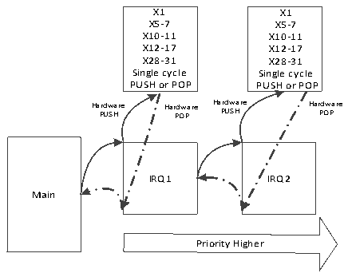

<!-- source-page: 28 -->

[← p.27](0027.md) · [index](../README.md) · [PDF p.28](https://ch32-riscv-ug.github.io/WCH-common/datasheet_en/QingKeV3_Processor_Manual.PDF#page=28) · [p.29 →](0029.md)

<!-- header: QingKeV3 Microprocessor Manual https://wch-ic.com -->

## 3.3 Interrupt Nesting

In conjunction with the interrupt configuration register PFIC_CFGR and the interrupt priority register  
PFIC_IPRIOR, nesting of interrupts can be allowed to occur. Enable nesting in the interrupt configuration  
register (Nesting is turned on by default for V3 series microprocessors) and configure the priority of the  
corresponding interrupt. The smaller the priority value, the higher the priority. The smaller the value of the  
preemption bit, the higher the preemption priority. If there are interrupts hanging at the same time under the  
same preemption priority, the microprocessor responds to the interrupt with the lower priority value (higher  
priority) first.  

## 3.4 Hardware Prologue/Epilogue (HPE)

When an exception or interrupt occurs, the microprocessor stops the current program flow and shifts to the  
execution of the exception or interrupt handling function, the site of the current program flow needs to be  
saved. After the exception or interrupt returns, it is necessary to restore the site and continue the execution of  
the stopped program flow. For V3 series microprocessors, the &quot;site&quot; here refers to all the Caller Saved registers  
in Table 1-2.  
The V3 series microprocessors support hardware single-cycle automatic saving of 16 of the integer Caller  
Saved registers to an internal stack area that is not visible to the user. When an exception or interrupt returns,  
the hardware single cycle automatically restores the data from the internal stack area to the 16 integer registers.  
HPE supports nesting up to 2 levels deep.  
A schematic of the microprocessor pressure stack is shown in the following figure.  

Figure 3-1 Schematic diagram of pressure stack  
 <!-- rendered from the PDF; verify at https://ch32-riscv-ug.github.io/WCH-common/datasheet_en/QingKeV3_Processor_Manual.PDF#page=28 -->

Internal Hardware Stack  

🖼 Text parsed from the figure above

X1 X1  
X5-7 X5-7  
X10-11 X10-11  
X12-17 X12-17  
X28-31 X28-31  
Single cycle Single cycle  
PUSH or POP PUSH or POP  
Ha P r U dw SH are Har P d O w P are Ha P r U dw SH are Har P d O w P are  
IRQ1 IRQ2  
Main  
Priority Higher  

<em>Note: 1. Interrupt functions using the HPE need to be compiled using MRS or its provided toolchain and the</em>  
<em>interrupt function needs to be declared with __attribute__((interrupt(&quot;WCH-Interrupt-fast&quot;))).</em>  
<em>2. The interrupt function using stack push is declared by __attribute__((interrupt())).</em>  

## 3.5 Vector Table Free (VTF)

The Programmable Fast Interrupt Controller (PFIC) provides 4 VTF channels, i.e., direct access to the interrupt  
function entry without going through the interrupt vector table lookup process.  
The VTF channel can be enabled by writing its interrupt number, interrupt service function base address and  
<!-- image: p28-draw-image-00001 bbox=[507.6, 794.4, 527.28, 805.44] -->
<!-- footer: V1.5 27 -->
