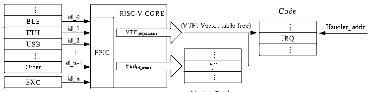

<!-- source-page: 29 -->

[← p.28](0028.md) · [index](../README.md) · [PDF p.29](https://ch32-riscv-ug.github.io/WCH-common/datasheet_en/QingKeV3_Processor_Manual.PDF#page=29) · [p.30 →](0030.md)

<!-- header: QingKeV3 Microprocessor Manual https://wch-ic.com -->
offset address into the corresponding PFIC controller register while configuring an interrupt function normally.  
The PFIC response process for fast and table-free interrupts is shown in Figure 3-2 below.  

Figure 3-2 Schematic diagram of programmable fast interrupt controller  
 <!-- rendered from the PDF; verify at https://ch32-riscv-ug.github.io/WCH-common/datasheet_en/QingKeV3_Processor_Manual.PDF#page=29 -->

Peripherals  

🖼 Text parsed from the figure above

...  BLE  ETH  ETHUSB  ...  Other  
RISC-V COREVTF(IRQn,addr) FPICFast(id_num)  VTF(IRQn,addr)  VTF(IRQn,addr)  Fast(id_num)  
Code  
id_0  
...  IRQ  ...  
id_1  
id_2  
...  “j”  ...  
...  
id_n-1  
id_n  
EXC  

Vector Table  
<!-- image: p29-draw-image-00001 bbox=[507.6, 794.4, 527.28, 805.44] -->
<!-- footer: V1.5 28 -->
