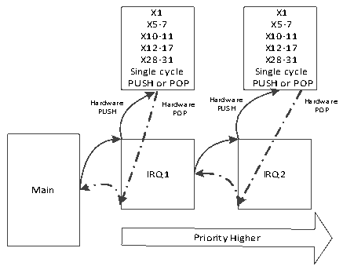
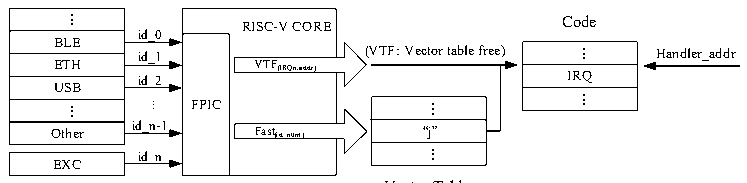

<!-- source-page: 24 -->

[← p.23](0023.md) · [index](../README.md) · [PDF p.24](https://ch32-riscv-ug.github.io/WCH-common/datasheet_zh/QingKeV3_Processor_Manual.PDF#page=24) · [p.25 →](0025.md)

<!-- header: QingKeV3微处理器手册 http://wch.cn -->

图3-1压栈示意图  
 <!-- rendered from the PDF; verify at https://ch32-riscv-ug.github.io/WCH-common/datasheet_zh/QingKeV3_Processor_Manual.PDF#page=24 -->

Internal Hardware Stack  

🖼 Text parsed from the figure above

X1 X1  
X5-7 X5-7  
X10-11 X10-11  
X12-17 X12-17  
X28-31 X28-31  
Single cycle Single cycle  
PUSH or POP PUSH or POP  
Ha P r U dw SH are Har P d O w P are Ha P rd U w SH are Har P d O w P are  
IRQ1 IRQ2  
Main  
Priority Higher  

注： 1.使用硬件压栈的中断函数需要使用MRS或者其提供的工具链进行编译且中断函数需要  
采用__attribute__((interrupt(&quot;WCH-Interrupt-fast&quot;)))声明。  
2.使用软件压栈的中断函数采用__attribute__((interrupt()))声明。  

## 3.5 免表中断

可编程快速中断控制器（PFIC）提供四个免表（Vector Table Free）中断通道，即不经过中断  
向量表的查表过程，直达中断函数入口。  
正常配置一个中断函数的同时，将其中断编号、中断服务函数基地址和偏移地址写入对应的PFIC  
控制器寄存器中，即可使能VTF通道。其可以减小中断响应延迟，在非零等待存储器中更明显。PFIC  
对于快速中断和免表中断的响应过程如下图3-2所示。  

图3-2 可编程快速中断控制器示意图  
 <!-- rendered from the PDF; verify at https://ch32-riscv-ug.github.io/WCH-common/datasheet_zh/QingKeV3_Processor_Manual.PDF#page=24 -->

Peripherals  

🖼 Text parsed from the figure above

...  BLE  ETH  ETHUSB  ...  Other  
RISC-V COREVTF(IRQn,addr) FPICFast(id_num)  VTF(IRQn,addr)  VTF(IRQn,addr)  Fast(id_num)  
Code  
id_0  
...  IRQ  ...  
id_1  
id_2  
...  “j”  ...  
...  
id_n-1  
id_n  
EXC  

Vector Table  
<!-- image: p24-draw-image-00001 bbox=[507.6, 786.48, 527.28, 797.04] -->
<!-- footer: V1.5 23 -->
