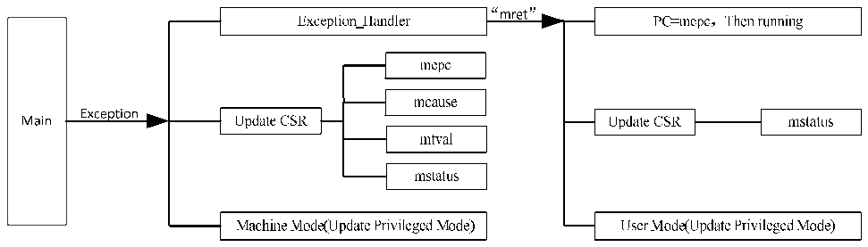

<!-- source-page: 8 -->

[← p.7](0007.md) · [index](../README.md) · [PDF p.8](https://ch32-riscv-ug.github.io/WCH-common/datasheet_en/QingKeV4_Processor_Manual.PDF#page=8) · [p.9 →](0009.md)

<!-- header: QingKeV4 Microprocessor Manual https://wch-ic.com -->
jumps to execute it.  

## 2.4 Exception Exit

After the exception or interrupt handler is completed, it is necessary to exit from the service program. After  
entering exceptions and interrupts, the microprocessor enters Machine mode from User mode, and the  
processing of exceptions and interrupts is also completed in Machine mode. When it is necessary to exit  
exceptions and interrupts, it is necessary to use the mret instruction to return. At this time, the  
microprocessor hardware will automatically perform the following operations.  
● The PC pointer is restored to the value of CSR register mepc, i.e., execution starts at the instruction  
address saved by mepc. It is necessary to pay attention to the offset operation of mepc after the  
exception handling is completed.  
● Update CSR register mstatus, MIE is restored to MPIE, and MPP is used to restore the privileged mode  
of the previous microprocessor.  
The entire exception response process can be described by the following Figure 2-1.  

Figure 2-1 Exception response process diagram  
 <!-- rendered from the PDF; verify at https://ch32-riscv-ug.github.io/WCH-common/datasheet_en/QingKeV4_Processor_Manual.PDF#page=8 -->

🖼 Text parsed from the figure above

<!-- image: p8-draw-image-00022 inside the figure -->
<!-- image: p8-draw-image-00024 inside the figure -->
<!-- image: p8-draw-image-00023 inside the figure -->
<!-- image: p8-draw-image-00004 inside the figure -->
<!-- image: p8-draw-image-00006 inside the figure -->
<!-- image: p8-draw-image-00029 inside the figure -->
<!-- image: p8-draw-image-00025 inside the figure -->
<!-- image: p8-draw-image-00027 inside the figure -->
<!-- image: p8-draw-image-00026 inside the figure -->
<!-- image: p8-draw-image-00028 inside the figure -->
<!-- image: p8-draw-image-00005 inside the figure -->
<!-- image: p8-draw-image-00008 inside the figure -->
<!-- image: p8-draw-image-00009 inside the figure -->
<!-- image: p8-draw-image-00003 inside the figure -->
<!-- image: p8-draw-image-00007 inside the figure -->
<!-- image: p8-draw-image-00002 inside the figure -->
<!-- image: p8-draw-image-00038 inside the figure -->
<!-- image: p8-draw-image-00021 inside the figure -->
<!-- image: p8-draw-image-00010 inside the figure -->
<!-- image: p8-draw-image-00011 inside the figure -->
<!-- image: p8-draw-image-00013 inside the figure -->
<!-- image: p8-draw-image-00014 inside the figure -->
<!-- image: p8-draw-image-00015 inside the figure -->
<!-- image: p8-draw-image-00016 inside the figure -->
<!-- image: p8-draw-image-00017 inside the figure -->
<!-- image: p8-draw-image-00019 inside the figure -->
<!-- image: p8-draw-image-00020 inside the figure -->
<!-- image: p8-draw-image-00031 inside the figure -->
<!-- image: p8-draw-image-00032 inside the figure -->
<!-- image: p8-draw-image-00033 inside the figure -->
<!-- image: p8-draw-image-00034 inside the figure -->
<!-- image: p8-draw-image-00036 inside the figure -->
<!-- image: p8-draw-image-00037 inside the figure -->
<!-- image: p8-draw-image-00012 inside the figure -->
<!-- image: p8-draw-image-00018 inside the figure -->
<!-- image: p8-draw-image-00030 inside the figure -->
<!-- image: p8-draw-image-00035 inside the figure -->

<!-- image: p8-draw-image-00001 bbox=[507.84, 794.64, 527.28, 805.2] -->
<!-- footer: V1.5 7 -->
