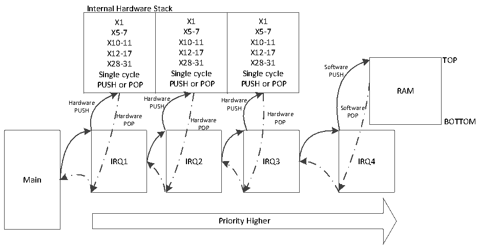
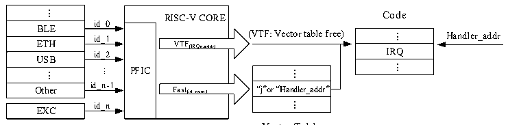

<!-- source-page: 19 -->

[← p.18](0018.md) · [index](../README.md) · [PDF p.19](https://ch32-riscv-ug.github.io/WCH-common/datasheet_en/QingKeV4_Processor_Manual.PDF#page=19) · [p.20 →](0020.md)

<!-- header: QingKeV4 Microprocessor Manual https://wch-ic.com -->
function using hardware stack needs to be set to the lowest three levels.  
A schematic of the microprocessor pressure stack is shown in the following figure.  

Figure 3-1 Schematic diagram of pressure stack  
 <!-- rendered from the PDF; verify at https://ch32-riscv-ug.github.io/WCH-common/datasheet_en/QingKeV4_Processor_Manual.PDF#page=19 -->

🖼 Text parsed from the figure above

Internal Hardware Stack  
Internal Hardware SX1X5-7X10-11X12-17X28-31 Single cycle PUSH or POP  Stack X1X5-7X10-11X12-17X28-31 Single cycle PUSH or POP  X1X5-7X10-11X12-17X28-31 Single cycle PUSH or POP  
Software  
RAM  
Hardware Hardware Hardware  
PUSH PUSH PUSH Software  
Hardware Hardware POP  
POP Hardware POP BOTTOM  
POP  
IRQ1 IRQ2 IRQ3 IRQ4  
Main  
Priority Higher  

<em>Note: 1. Hardware pressure stack depth may vary from model to model.</em>  
<em>2.Interrupt functions using the hardware stack need to be compiled using MRS or its provided toolchain</em>  
<em>and the interrupt functions need to be declared with__attribute__((interrupt(&quot;WCH-Interrupt-fast&quot;))).</em>  
<em>3.If hardware floating point is used, the interrupt function with hardware stack declaration, the</em>  
<em>floating-point registers are still saved and restored by the compiler in software, and they are saved to the</em>  
<em>user stack area (RAM).</em>  
<em>4.The interrupt function using stack push is declared by__attribute__((interrupt())).</em>  

## 3.5 Vector Table Free (VTF)

The Programmable Fast Interrupt Controller (PFIC) provides two VTF channels, i.e., direct access to the  
interrupt function entry without going through the interrupt vector table lookup process.  
The PFIC responds to fast interrupts and VTF as shown in Figure 3-2 below.  

Figure 3-2 Schematic diagram of programmable fast interrupt controller  
 <!-- rendered from the PDF; verify at https://ch32-riscv-ug.github.io/WCH-common/datasheet_en/QingKeV4_Processor_Manual.PDF#page=19 -->

Peripherals  

🖼 Text parsed from the figure above

...  BLE  ETH  ETHUSB  ...  Other  
RISC-V COREVTF(IRQn,addr) PFICFast(id_num)  VTF(IRQn,addr)  VTF(IRQn,addr)  Fast(id_num)  
Code  
id_0  
...  IRQ  ...  
id_1  
id_2  
...  “j”o r“Handler_addr”  ...  
...  
id_n-1  
id_n  
EXC  

Vector Table  
<!-- image: p19-draw-image-00001 bbox=[507.84, 794.64, 527.28, 805.2] -->
<!-- footer: V1.5 18 -->
