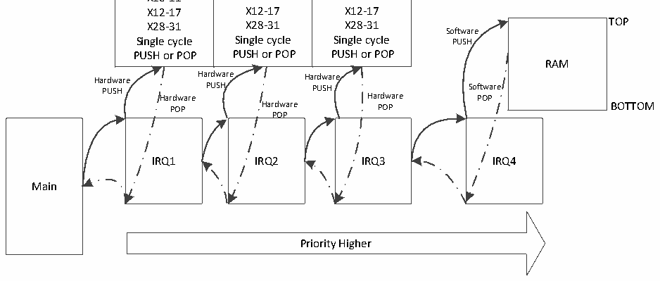

<!-- source-page: 15 -->

[← p.14](0014.md) · [index](../README.md) · [PDF p.15](https://ch32-riscv-ug.github.io/WCH-common/datasheet_zh/QingKeV4_Processor_Manual.PDF#page=15) · [p.16 →](0016.md)

<!-- header: QingKeV4微处理器手册 http://wch.cn -->
其各位定义为：  

<!-- p15-table-001 (table-3-2@1) -->
<table><tr><th>位</th><th>名称</th><th>访问</th><th>描述</th><th>复位值</th></tr><tr><td>[31:2]</td><td>BASEADDR[31:2]</td><td>MRW</td><td>中断向量表基地址。</td><td>0</td></tr><tr><td>1</td><td>MODE1</td><td>MRW</td><td style="text-align:left">中断向量表识别模式： 0：按跳转指令识别，有限范围，支持非跳指令； 1：按绝对地址识别，支持全范围，但必须跳转。</td><td>0</td></tr><tr><td>0</td><td>MODE0</td><td>MRW</td><td style="text-align:left">中断或异常入口地址模式选择： 0：使用统一入口地址； 1：根据中断编号*4进行地址偏移。</td><td>0</td></tr></table>

对于V4系列微处理器的MCU，启动文件里默认配置了MODE[1:0]=11，即向量表使用中断函数的  
绝对地址，且异常或中断的入口根据中断编号*4进行偏移。  

## 3.3 中断嵌套

配合中断系统控制寄存器INTSYSCR（CSR地址：0x804）和中断优先级寄存器PFIC_IPRIOR，可  
以允许中断发生嵌套。在中断系统控制寄存器中使能嵌套和配置嵌套深度（V4系列MCU在启动文件  
中进行配置），并且配置对应中断的优先级。优先级数值越小，优先级越高。抢占位数值越小，抢占  
优先级越高。同一抢占优先级下，若有中断同时挂起，微处理器优先响应优先级数值较小（优先级高）  
的中断。  

## 3.4 硬件压栈

当发生异常或者中断时，微处理器停止当前程序流，转向执行异常或者中断处理函数时，需要对  
当前程序流的现场进行保存。异常或中断返回后，需要恢复现场后，继续执行停止的程序流。对于  
V4系列微处理器，这里的“现场”指的是表1-2中，所有的Caller Saved寄存器。  
V4系列微处理器，支持硬件单周期自动保存其中16个整形Caller Saved寄存器至内部的堆栈  
区域，该区域对用户不可见。当异常或者中断返回后，硬件单周期自动从内部堆栈区恢复数据至16  
个整形寄存器。硬件压栈支持嵌套，嵌套深度最大为3级。硬件压栈溢出后，若仍然允许更高优先级  
的中断执行，则“现场”被保存至用户堆栈区。  
当配置允许的中断嵌套深度大于硬件压栈深度时，可以通过中断系统控制寄存器INTSYSCR的  
bit4位设置硬件压栈溢出后，关闭中断响应，即最大嵌套深度为3级，均使用硬件压栈。若允许硬  
件压栈溢出后，中断继续执行，则需要将采用硬件压栈的中断函数的优先级设置为最低的三级。  
微处理器压栈示意图如下图所示：  

图3-1 压栈示意图  
 <!-- rendered from the PDF; verify at https://ch32-riscv-ug.github.io/WCH-common/datasheet_zh/QingKeV4_Processor_Manual.PDF#page=15 -->

<!-- image: p15-draw-image-00001 bbox=[507.84, 786.36, 527.28, 796.68] -->
<!-- footer: V1.5 14 -->
