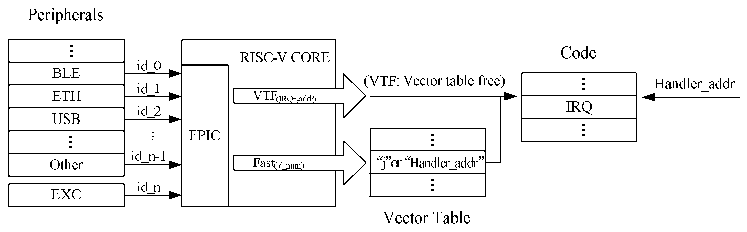

<!-- source-page: 16 -->

[← p.15](0015.md) · [index](../README.md) · [PDF p.16](https://ch32-riscv-ug.github.io/WCH-common/datasheet_zh/QingKeV4_Processor_Manual.PDF#page=16) · [p.17 →](0017.md)

<!-- header: QingKeV4微处理器手册 http://wch.cn -->
Internal Hardware Stack  

🖼 Text parsed from the figure above

Internal Hardware SX1X5-7X10-11X12-17X28-31 Single cycle PUSH or POP  Stack X1X5-7X10-11X12-17X28-31 Single cycle PUSH or POP  X1X5-7X10-11X12-17X28-31 Single cycle PUSH or POP  
Software  
RAM  
Hardware Hardware Hardware  
PUSH PUSH PUSH Software  
Hardware Hardware POP  
POP Hardware POP BOTTOM  
POP  
IRQ1 IRQ2 IRQ3 IRQ4  
Main  
Priority Higher  

注：1.不同型号，硬件压栈深度可能不同。  
2.使用硬件压栈的中断函数需要使用MRS或者其提供的工具链进行编译且中断函数需要采用  
__attribute__((interrupt(&quot;WCH-Interrupt-fast&quot;)))声明。  
3.若使用硬件浮点，采用硬件压栈声明的中断函数，浮点寄存器的保存仍由编译器进行软件保存  
和恢复，且均被保存至用户堆栈区（RAM）。  
4.使用软件压栈的中断函数采用__attribute__((interrupt()))声明。  

## 3.5 免表中断

可编程快速中断控制器（PFIC）提供四个免表（Vector Table Free）中断通道，即不经过中断  
向量表的查表过程，直达中断函数入口。  
正常配置一个中断函数的同时，将其中断编号写入免表中断ID寄存器PFIC_VTFIDR的某个通道  
x，同时将其入口地址写入对应的免表中断地址寄存器VTFADDRRx，并且使能该通道VTF中断即可。  
PFIC对于快速中断和免表中断的响应过程如下图3-2所示。  

图3-2 可编程快速中断控制器示意图  
 <!-- rendered from the PDF; verify at https://ch32-riscv-ug.github.io/WCH-common/datasheet_zh/QingKeV4_Processor_Manual.PDF#page=16 -->

🖼 Text parsed from the figure above

<!-- image: p16-draw-image-00008 inside the figure -->
<!-- image: p16-draw-image-00002 inside the figure -->
<!-- image: p16-draw-image-00044 inside the figure -->
<!-- image: p16-draw-image-00029 inside the figure -->
<!-- image: p16-draw-image-00031 inside the figure -->
<!-- image: p16-draw-image-00030 inside the figure -->
<!-- image: p16-draw-image-00011 inside the figure -->
<!-- image: p16-draw-image-00013 inside the figure -->
<!-- image: p16-draw-image-00003 inside the figure -->
<!-- image: p16-draw-image-00012 inside the figure -->
<!-- image: p16-draw-image-00045 inside the figure -->
<!-- image: p16-draw-image-00048 inside the figure -->
<!-- image: p16-draw-image-00049 inside the figure -->
<!-- image: p16-draw-image-00046 inside the figure -->
<!-- image: p16-draw-image-00041 inside the figure -->
<!-- image: p16-draw-image-00043 inside the figure -->
<!-- image: p16-draw-image-00047 inside the figure -->
<!-- image: p16-draw-image-00039 inside the figure -->
<!-- image: p16-draw-image-00014 inside the figure -->
<!-- image: p16-draw-image-00016 inside the figure -->
<!-- image: p16-draw-image-00004 inside the figure -->
<!-- image: p16-draw-image-00042 inside the figure -->
<!-- image: p16-draw-image-00032 inside the figure -->
<!-- image: p16-draw-image-00015 inside the figure -->
<!-- image: p16-draw-image-00036 inside the figure -->
<!-- image: p16-draw-image-00033 inside the figure -->
<!-- image: p16-draw-image-00034 inside the figure -->
<!-- image: p16-draw-image-00037 inside the figure -->
<!-- image: p16-draw-image-00035 inside the figure -->
<!-- image: p16-draw-image-00038 inside the figure -->
<!-- image: p16-draw-image-00017 inside the figure -->
<!-- image: p16-draw-image-00019 inside the figure -->
<!-- image: p16-draw-image-00005 inside the figure -->
<!-- image: p16-draw-image-00018 inside the figure -->
<!-- image: p16-draw-image-00040 inside the figure -->
<!-- image: p16-draw-image-00010 inside the figure -->
<!-- image: p16-draw-image-00020 inside the figure -->
<!-- image: p16-draw-image-00060 inside the figure -->
<!-- image: p16-draw-image-00006 inside the figure -->
<!-- image: p16-draw-image-00021 inside the figure -->
<!-- image: p16-draw-image-00025 inside the figure -->
<!-- image: p16-draw-image-00023 inside the figure -->
<!-- image: p16-draw-image-00050 inside the figure -->
<!-- image: p16-draw-image-00055 inside the figure -->
<!-- image: p16-draw-image-00052 inside the figure -->
<!-- image: p16-draw-image-00059 inside the figure -->
<!-- image: p16-draw-image-00024 inside the figure -->
<!-- image: p16-draw-image-00051 inside the figure -->
<!-- image: p16-draw-image-00056 inside the figure -->
<!-- image: p16-draw-image-00058 inside the figure -->
<!-- image: p16-draw-image-00063 inside the figure -->
<!-- image: p16-draw-image-00007 inside the figure -->
<!-- image: p16-draw-image-00053 inside the figure -->
<!-- image: p16-draw-image-00054 inside the figure -->
<!-- image: p16-draw-image-00065 inside the figure -->
<!-- image: p16-draw-image-00022 inside the figure -->
<!-- image: p16-draw-image-00064 inside the figure -->
<!-- image: p16-draw-image-00068 inside the figure -->
<!-- image: p16-draw-image-00067 inside the figure -->
<!-- image: p16-draw-image-00057 inside the figure -->
<!-- image: p16-draw-image-00066 inside the figure -->
<!-- image: p16-draw-image-00061 inside the figure -->
<!-- image: p16-draw-image-00026 inside the figure -->
<!-- image: p16-draw-image-00028 inside the figure -->
<!-- image: p16-draw-image-00009 inside the figure -->
<!-- image: p16-draw-image-00027 inside the figure -->
<!-- image: p16-draw-image-00062 inside the figure -->

<!-- image: p16-draw-image-00001 bbox=[507.84, 786.36, 527.28, 796.68] -->
<!-- footer: V1.5 15 -->
