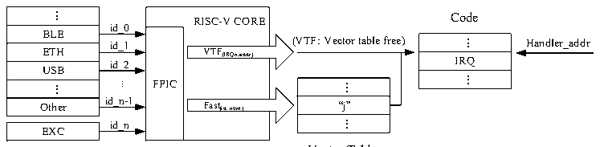

<!-- source-page: 23 -->

[← p.22](0022.md) · [index](../README.md) · [PDF p.23](https://ch32-riscv-ug.github.io/WCH-common/datasheet_en/QingKeV5_Processor_Manual.PDF#page=23) · [p.24 →](0024.md)

<!-- header: QingKeV5 Microprocessor Manual https://wch-ic.com -->
Internal Hardware Stack  

🖼 Text parsed from the figure above

X1 X1  
X5-7 X5-7  
X10-11 X10-11  
X12-17 X12-17  
X28-31 X28-31  
Single cycle Single cycle  
PUSH or POP PUSH or POP  
Ha P r U dw SH are Har P d O w P are Ha P r U dw SH are Har P d O w P are  
IRQ1 IRQ2  
Main  
Priority Higher  

<em>Note: 1. Interrupt functions using the HPE need to be compiled using MRS or its provided toolchain and the</em>  
<em>interrupt function needs to be declared with __attribute__((interrupt(&quot;WCH-Interrupt-fast&quot;))).</em>  
<em>2. The interrupt function using stack push is declared by __attribute__((interrupt())).</em>  

## 3.5 Vector Table Free (VTF)

The Programmable Fast Interrupt Controller (PFIC) provides 4 VTF channels, i.e., direct access to the interrupt  
function entry without going through the interrupt vector table lookup process.  
The VTF channel can be enabled by writing its interrupt number, interrupt service function base address and  
offset address into the corresponding PFIC controller register while configuring an interrupt function normally.  
The PFIC response process for fast and table-free interrupts is shown in Figure 3-2 below.  

Figure 3-2 Schematic diagram of programmable fast interrupt controller  
 <!-- rendered from the PDF; verify at https://ch32-riscv-ug.github.io/WCH-common/datasheet_en/QingKeV5_Processor_Manual.PDF#page=23 -->

Peripherals  

🖼 Text parsed from the figure above

...  BLE  ETH  ETHUSB  ...  Other  
RISC-V COREVTF(IRQn,addr) FPICFast(id_num)  VTF(IRQn,addr)  VTF(IRQn,addr)  Fast(id_num)  
Code  
id_0  
...  IRQ  ...  
id_1  
id_2  
...  “j”  ...  
...  
id_n-1  
id_n  
EXC  

Vector Table  
<!-- image: p23-draw-image-00001 bbox=[507.6, 794.4, 527.28, 805.44] -->
<!-- footer: V1.0 22 -->
