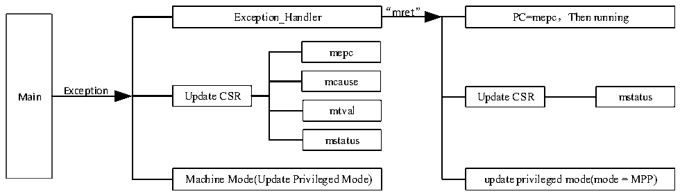

<!-- source-page: 6 -->

[← p.5](0005.md) · [index](../README.md) · [PDF p.6](https://ch32-riscv-ug.github.io/WCH-common/datasheet_zh/QingKeV5_Processor_Manual.PDF#page=6) · [p.7 →](0007.md)

<!-- header: QingKeV5微处理器手册 http://wch.cn -->

## 2.4 异常退出

异常或中断处理程序完成之后，需要从服务程序中退出。进入异常和中断后，微处理器由用户模  
式进入机器模式，异常和中断的处理也在机器模式下完成，当需要退出异常和中断时，需要使用mret  
指令进行返回。此时，微处理器硬件将自动执行如下操作：  
● PC指针恢复为CSR寄存器mepc的值，即从mepc保存的指令地址处开始执行。需要注意异  
常处理完成后对mepc的偏移操作。  
● 更新CSR寄存器mstatus，MIE恢复为MPIE，MPP用于恢复之前的微处理器的特权模式。  
整个异常的响应过程可由下图2-1描述：  

图2-1异常响应过程示意图  
 <!-- rendered from the PDF; verify at https://ch32-riscv-ug.github.io/WCH-common/datasheet_zh/QingKeV5_Processor_Manual.PDF#page=6 -->

🖼 Text parsed from the figure above

“mret”  
PC=mepc，Then running  
Exception_Handler  
mepc  
mcause  
Exception  
Main Update CSR Update CSR mstatus  
mtval  
mstatus  
Machine Mode(Update Privileged Mode) update privileged mode(mode = MPP)  

<!-- image: p6-draw-image-00001 bbox=[507.6, 786.48, 527.28, 797.04] -->
<!-- footer: V1.0 5 -->
