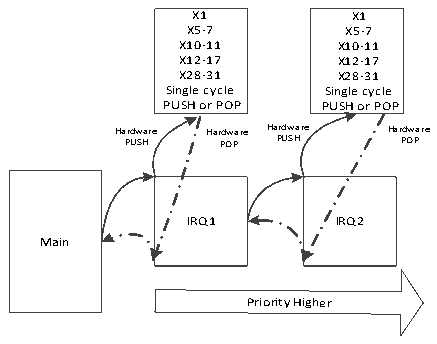

<!-- source-page: 18 -->

[← p.17](0017.md) · [index](../README.md) · [PDF p.18](https://ch32-riscv-ug.github.io/WCH-common/datasheet_zh/QingKeV5_Processor_Manual.PDF#page=18) · [p.19 →](0019.md)

<!-- header: QingKeV5微处理器手册 http://wch.cn -->

> ⬆ **Table continued** — rendered in full at [page 17](0017.md). <!-- p18-table-001 -->

## 3.3 中断嵌套

配合中断配置寄存器PFIC_CFGR和中断优先级寄存器PFIC_IPRIOR，可以允许中断发生嵌套。在  
中断配置寄存器中使能嵌套（V5系列微处理器默认打开嵌套），并且配置对应中断的优先级。优先  
级数值越小，优先级越高。抢占位数值越小，抢占优先级越高。同一抢占优先级下，若有中断同时挂  
起，微处理器优先响应优先级数值较小（优先级高）的中断。  

## 3.4 硬件压栈

当发生异常或者中断时，微处理器停止当前程序流，转向执行异常或者中断处理函数时，需要对  
当前程序流的现场进行保存。异常或中断返回后，需要恢复现场后，继续执行停止的程序流。对于  
V5系列微处理器，这里的“现场”指的是表1-2中，所有的Caller Saved寄存器。  
V5系列微处理器，支持硬件单周期自动保存其中16个整型Caller Saved寄存器压入DTCM区域，  
压入的具体地址可通过CSR 0xBC4配置。当异常或者中断返回后，硬件自动从内部堆栈区恢复数据至  
16个整型寄存器。硬件压栈支持嵌套，嵌套深度最大为8级。  
微处理器压栈示意图如下图所示：  

图3-1压栈示意图  
 <!-- rendered from the PDF; verify at https://ch32-riscv-ug.github.io/WCH-common/datasheet_zh/QingKeV5_Processor_Manual.PDF#page=18 -->

Internal Hardware Stack  

🖼 Text parsed from the figure above

X1 X1  
X5-7 X5-7  
X10-11 X10-11  
X12-17 X12-17  
X28-31 X28-31  
Single cycle Single cycle  
PUSH or POP PUSH or POP  
Ha P r U dw SH are Har P d O w P are Ha P rd U w SH are Har P d O w P are  
IRQ1 IRQ2  
Main  
Priority Higher  

注： 1.使用硬件压栈的中断函数需要使用MRS或者其提供的工具链进行编译且中断函数需要  
采用__attribute__((interrupt(&quot;WCH-Interrupt-fast&quot;)))声明。  
2.使用软件压栈的中断函数采用__attribute__((interrupt()))声明。  
<!-- image: p18-draw-image-00001 bbox=[507.6, 786.48, 527.28, 797.04] -->
<!-- footer: V1.0 17 -->
