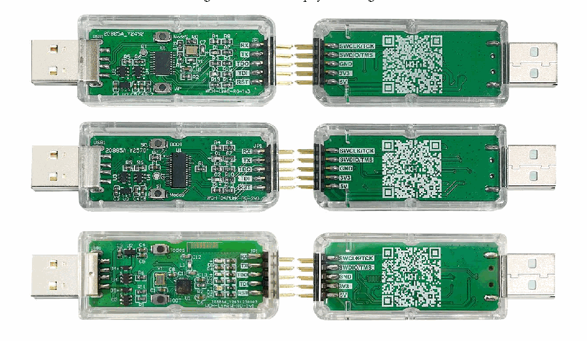
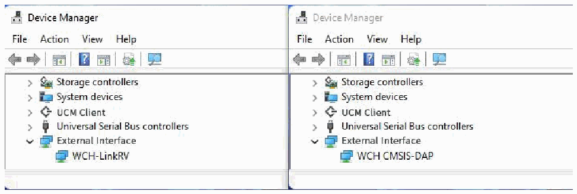

<!-- source-page: 1 -->

[index](../README.md) · [PDF p.1](https://ch32-riscv-ug.github.io/WCH-common/datasheet_en/WCH-LinkUserManual.PDF#page=1) · [p.2 →](0002.md)

<!-- header: WCH-LinkUserManual https://wch-ic.com -->

# WCH-LinkUserManual

Version: V2.7  
https://wch-ic.com  

# 1 WCH-Link

## 1.1 Module Introduction

WCH-Link module can be used for online debugging and downloading of WCH RISC-V MCU, and also for  
online debugging and downloading of ARM MCU with SWD/JTAG interface. It also comes with a serial  
port for easy debugging output. There are currently 3 WCH-Links including WCH-LinkE, WCH-DAPLink,  
and WCH-LinkW, and WCH-LinkE is recommended.  

Figure 1 WCH-Link physical diagram  
 <!-- rendered from the PDF; verify at https://ch32-riscv-ug.github.io/WCH-common/datasheet_en/WCH-LinkUserManual.PDF#page=1 -->

🖼 Text parsed from the figure above

<!-- image: p1-draw-image-00002 inside the figure -->

Figure 2 WCH-Link mode  
 <!-- rendered from the PDF; verify at https://ch32-riscv-ug.github.io/WCH-common/datasheet_en/WCH-LinkUserManual.PDF#page=1 -->

🖼 Text parsed from the figure above

<!-- image: p1-draw-image-00003 inside the figure -->

Table 1 WCH-Link mode  

<!-- p1-table-001 (unlabelled-p1-1) pages 1-2 -->
<table><tr><th>Mode</th><th>Status LED</th><th>IDE</th><th>Support chip</th></tr><tr><td>RISC-V</td><td style="text-align:left">Blue LED is always off when idle</td><td>MounRiver Studio</td><td style="text-align:left">WCH RISC-V core chips that support single/dual line debugging</td></tr><tr><td>ARM</td><td style="text-align:left">Blue LED is always on when idle</td><td>Keil/MounRiver Studio</td><td style="text-align:left">ARM core chips that support SWD/JTAG protocol</td></tr></table>

<!-- image: p1-draw-image-00001 bbox=[508.2, 795.0, 527.28, 805.2] -->
<!-- footer: V2.7 1 -->
