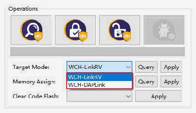
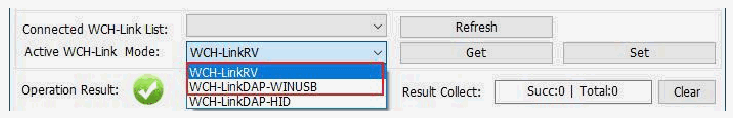

<!-- source-page: 2 -->

[← p.1](0001.md) · [index](../README.md) · [PDF p.2](https://ch32-riscv-ug.github.io/WCH-common/datasheet_en/WCH-LinkUserManual.PDF#page=2) · [p.3 →](0003.md)

<!-- header: WCH-LinkUserManual https://wch-ic.com -->

> ⬆ **Table continued** — rendered in full at [page 1](0001.md). <!-- p2-table-001 -->

## 1.2 Mode Switching

Way 1: Use MounRiver Studio software to switch Link mode. (This method is applicable to WCH-Link,  
WCH-LinkE and WCH-LinkW)  
<!-- image: p2-draw-image-00002 bbox=[135.96, 157.8, 166.68, 173.52] -->
① Click arrow in the shortcut toolbar to bring up the project download configuration window  
② Click Query on the right side of Target Mode to view the current Link mode  
③ Click Target Mode option box, select the target Link mode, click Apply  

 <!-- p2-draw-image-00003 rendered from the PDF -->

Way 2: Use WCH-LinkUtility tool to switch Link mode.  
① Click Get on the right side of Active WCH-Link mode to view the current Link mode  
② Click Active WCH-Link mode option box, select the target Link mode, click Set  

 <!-- p2-draw-image-00004 rendered from the PDF -->

Way 3: Use ModeS key to switch Link mode. (This method is applicable to WCH-LinkE-R0-1v2,  
WCH-DAPLink-R0-2v0 and WCH-LinkW-R0-1v1 and above)  
① Press and hold the ModeS key to power up the Link  
<em>Notes:</em>  
- <em>(1) The blue LED flashes when downloading and debugging.</em>
- <em>(2) The Link maintains the switched mode for subsequent use.</em>
- <em>(3) WCH-Link simulation debugger module URL: https://www.wch-ic.com/products/WCH-Link.html</em>
- <em>(4) MounRiver Studio Access URL: http://mounriver.com/</em>
- <em>(5) WCH-LinkUtility Access URL: https://www.wch.cn/downloads/WCH-LinkUtility_ZIP.html</em>
- <em>(6) WCHISPTool Access URL: https://www.wch.cn/downloads/WCHISPTool_Setup_exe.html</em>
- <em>(7) WCH-Link, WCH-LinkE and WCH-LinkW support LinkRV and LinkDAP-WINUSB mode switching;</em>
<em>WCH-DAPLink supports LinkDAP-WINUSB and LinKDAP-HID mode switching.</em>  

## 1.3 Serial Port Baud Rate

Table 2 WCH-Link serial port supports baud rate  

<!-- p2-table-002 (unlabelled-p2-2) -->
<table><tr><th>1200</th><th>2400</th><th>4800</th><th>9600</th><th>14400</th></tr><tr><td>19200</td><td>38400</td><td>57600</td><td>115200</td><td>230400</td></tr></table>

<!-- image: p2-draw-image-00001 bbox=[508.2, 795.0, 527.28, 805.2] -->
<!-- footer: V2.7 2 -->
