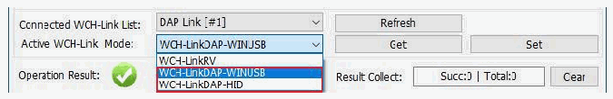
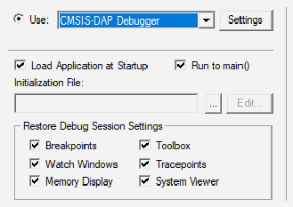

<!-- source-page: 7 -->

[← p.6](0006.md) · [index](../README.md) · [PDF p.7](https://ch32-riscv-ug.github.io/WCH-common/datasheet_en/WCH-LinkUserManual.PDF#page=7) · [p.8 →](0008.md)

<!-- header: WCH-LinkUserManual https://wch-ic.com -->

# 3 Keil Download and Debug

## 3.1 Device Switching

WCH-DAPLink supports two modes, ARM mode-WINUSB device and ARM mode-HID device, and you  
can switch between the two device modes with the WCH-LinkUtility tool (or by powering up the Link after  
long pressing the ModeS key.) WCH-Link, WCH-LinkE and WCH-LinkW only support ARM  
mode-WINUSB device mode.  

 <!-- p7-draw-image-00002 rendered from the PDF -->

Table 8 WCH-DAPLink device  

<!-- p7-table-001 (unlabelled-p7-1) -->
<table><tr><th>Device</th><th>Support Link</th><th>Keil supported versions</th></tr><tr><td>ARM mode-WINUSB device</td><td style="text-align:left">WCH-Link WCH-LinkEWCH-DAPLink WCH-LinkW</td><td style="text-align:left">Keil V5.25 and above ARM-CMSIS V5.3.0 and above</td></tr><tr><td>ARM mode-HID device</td><td>WCH-DAPLink</td><td>Supported in all versions of Keil</td></tr></table>

<em>Note:</em>  
- <em>(1) WCH-Link, WCH-LinkE, WCH-DAPLink and WCH-LinkW are factory defaulted to WINUSB device</em>
<em>mode.</em>  
- <em>(2) WCH-DAPLink-R0-1v0 switches between two device modes by long pressing the IAP key to power up.</em>
- <em>(3) WCH-LinkUtility tool on will occupy the Link device and cause Keil software can not recognize the Link.</em>

## 3.2 Download Configuration

<!-- image: p7-draw-image-00003 bbox=[183.96, 487.44, 204.96, 500.88] -->
① Click the magic wand in the toolbar to bring up the Options for Target dialog box, click Debug  
and select the emulator model  

 <!-- p7-draw-image-00004 rendered from the PDF -->

② Click the Use option box and select CMSIS-DAP Debugger  
③ Click the Settings button to bring up the Cortex-M Target Driver Setup dialog box  
<!-- image: p7-draw-image-00001 bbox=[508.2, 795.0, 527.28, 805.2] -->
<!-- footer: V2.5 7 -->
