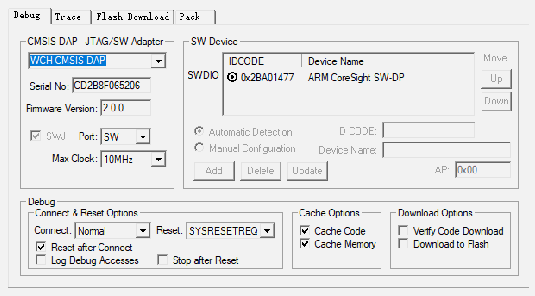
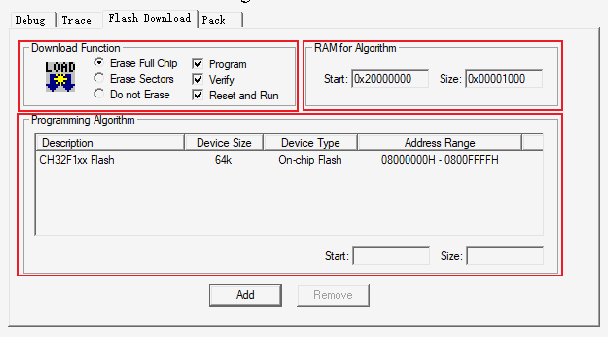

<!-- source-page: 8 -->

[← p.7](0007.md) · [index](../README.md) · [PDF p.8](https://ch32-riscv-ug.github.io/WCH-common/datasheet_en/WCH-LinkUserManual.PDF#page=8) · [p.9 →](0009.md)

<!-- header: WCH-LinkUserManual https://wch-ic.com -->

 <!-- p8-draw-image-00002 rendered from the PDF -->

Serial No: Display the identifier of the debug adapter being used. When multiple adapters are connected, you  
can specify the adapter by using the drop-down list.  
SW Device: Show the device ID and name of the connected device.  
Port: Set the internal debug interface SW or JTAG. (Both interfaces are supported by WCH-LinkE-R0-1v3,  
WCH-DAPLink-R0-2v0 and WCH-LinkW-R0-1v1)  
Max Clock: Set the clock rate to communicate with the target device.  
④ Click Flash Download for download configuration  

 <!-- p8-draw-image-00003 rendered from the PDF -->

Download Function: Configuration options  
RAM for Algorithm: Configure the starting address and size of RAM space  
Our CH32F103 series chip RAM space size is 0x1000, CH32F20x series chip RAM space size is 0x2800.  
Programming Algorithm: Add algorithm file  
The algorithm file has been added automatically after installing the chip device package, click OK.  
⑤ After completing the above configuration, click OK to close the dialog box. Click the icon in the  
toolbar to burn in the code.  

## 3.3 Debug

<!-- image: p8-draw-image-00004 bbox=[187.32, 639.96, 205.32, 656.4] -->
① Click the Debug button in the toolbar to enter the debug page  
② Set breakpoints  
<!-- image: p8-draw-image-00001 bbox=[508.2, 795.0, 527.28, 805.2] -->
<!-- footer: V2.5 8 -->
